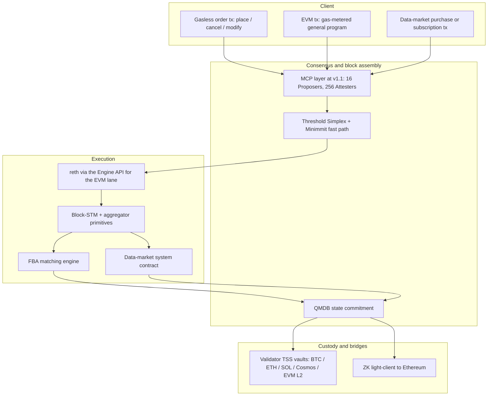

# UltraFast

### An Economic Operating System

**Derivatives. Data markets. General programs. One chain.**

## 1. In one paragraph

UltraFast is a Layer 1 blockchain — an economic operating system that runs multiple workloads on one consensus, execution, and custody stack. The anchor workload is unified on-chain derivatives: perpetual futures and scalar prediction markets, served by a single matching engine and a single cross-product margin system, invoked through gasless turing-incomplete order transactions that bypass the EVM gas mechanism. A native data sales market runs as a second workload, settling subscription and per-query payments for feeds, datasets, and oracle products. Arbitrary user programs run on the standard EVM lane with normal gas-metered transactions. UltraFast targets centralised-exchange latency without inheriting the trust assumptions of current on-chain venues. Matching is open-source and in-protocol. The validator set is open. Custody sits in stake-weighted threshold-signature vaults the validators jointly operate. Intra-tick MEV is removed by construction rather than by promise. Trading, data-market, listing, and EVM gas fees are denominated in Bitcoin, payable in any supported collateral, and set by on-chain governance vote weighted by bonded UFAST stake — the protocol does not hard-code fee levels. The full fee stream flows to stakers. UltraFast is the trading, risk-pricing, and on-chain-data counterpart to the new generation of stablecoin settlement chains.

---

## 2. The thesis: settlement is solved, pricing and on-chain data are not

The institutional case for on-chain finance has split into multiple half-built layers over the last twelve months.

The settlement half is well-funded and well-positioned. Circle's Arc raised $222M at a $3B FDV in May 2026 with BlackRock, Apollo, and ICE on the cap table, and targets summer 2026 for mainnet [1]. Stripe and Paradigm's Tempo went live in March 2026 [2]. Tether's Plasma has been live since 2025. All three target the same problem — stablecoin payments and tokenised-asset settlement on permissioned-to-semi-permissioned chains, with USDC, PYUSD, or USDT as the native gas asset and TradFi institutions as anchor partners.

The trading half is unsolved on the terms the institutional case actually requires. Hyperliquid leads on user experience and volume. The venue ships four properties that fail an institutional custody review: a closed-source matching engine, a team-controlled validator set of roughly 16–25 nodes, a public mempool from which order content is extractable in advance, and a stake-weighted ECDSA multisig bridge. Other on-chain venues either inherit the Cosmos SDK execution stack — with the recurring gas-refund and precompile-atomicity bug class catalogued in advisory GHSA-mjfq-3qr2-6g84 [3] — or split matching off the chain entirely, re-importing operator trust.

The on-chain data half is barely built at all. Oracles charge bilaterally negotiated off-chain rates. Index providers run subscription billing on legacy invoicing rails. Data marketplaces (Ocean, Streamr, Chainlink Functions) exist but settle in fragmented ways across chains, none of them in a fee path tied to the venue where the data is actually consumed. The natural place for an on-chain data marketplace is the chain that already runs derivatives, holds the collateral, and integrates with the largest oracle relationships. The same chain is where vaults, structured products, and lending markets can read entitlement state in the same call frame they trigger a downstream trade.

The institutional buyer of on-chain finance wants three properties from a venue: centralised-exchange performance, open and inspectable mechanics, and custody arrangements they can defend to a board. They want those properties across all the workloads they care about — trading, data, programmable strategies — not just one. No production venue offers all three across all three workloads.

UltraFast is the venue that does.

---

## 3. The economic operating system metaphor

An operating system mediates between hardware and applications. It runs a kernel that handles scheduling, memory, and I/O; it exposes a stable set of system calls; it isolates failures; and it gives every application a fair share of the underlying machine.

UltraFast applies the same separation of concerns to on-chain economic activity.

| OS concept | UltraFast equivalent |
|---|---|
| Kernel | The matching engine, the margin engine, and the data-market system contract, all in-protocol |
| System calls | Gasless order operations (`place`, `cancel`, `modify`, `batch-cancel`, `liquidate`); data-market operations (`purchase`, `subscribe`, `meter`); cross-margin offsets; builder-code accruals |
| Scheduler | Frequent batch auctions at a 100 ms tick — every market clears once per tick at a uniform price |
| Memory protection | Per-account risk isolation; one position's liquidation does not propagate to unrelated positions |
| Hardware | Threshold Simplex with the Minimmit fast path, reth via the Engine API, QMDB state backend |
| User programs | Derivatives (perps + scalar prediction markets), data products, vaults, structured products, lending markets, builder-deployed markets, and any other EVM contract |
| File system | Validator-operated threshold-signature vaults across Bitcoin, Ethereum, Solana, Cosmos, and EVM L2s |
| Process model | Two transaction lanes — gasless turing-incomplete for derivative orders, gas-metered EVM for general programs and data-market transactions — sharing one consensus and one block |

The metaphor extends to the failure model. A well-engineered operating system does not pretend faults cannot happen; it confines them. UltraFast confines consensus faults to graceful latency degradation, custody faults to a bonded slashing path, and matching faults to atomic per-tick reverts. The full whitepaper [§14] tabulates the attacks, the mitigations, and the residual risks accepted at launch.

The point of the metaphor is not that UltraFast is the only chain capable of doing this work. The point is that on-chain derivatives, on-chain data sales, and on-chain programmable strategies have until now been delivered as separate applications running on chains designed for other purposes. UltraFast's kernel, system calls, and hardware are designed together to run three classes of workload well — derivatives, data, and general programs — and to expose each workload to the others as a first-class system service.

---

## 4. Where UltraFast sits

The new stablecoin chains and UltraFast are not competitors. They are complementary layers in a complete on-chain financial system.

| | Settles spot value | Prices risk | Sells data |
|---|---|---|---|
| **TradFi reference** | CHIPS, FedWire, SWIFT, CLS | CME, ICE, Eurex, NYSE | Bloomberg, Refinitiv, ICE Data |
| **On-chain incumbent** | Ethereum L1, L2s | Hyperliquid, Aevo, Drift | Chainlink (free), Pyth, Ocean |
| **New institutional rails** | Arc, Tempo, Plasma | **UltraFast** | **UltraFast** |

UltraFast holds the column on the right alongside the derivatives column because both workloads belong on the venue that already holds the collateral and runs the matching. Tokenised treasuries, foreign-exchange stablecoins, and equity tokens need a derivatives layer. A treasurer holding tokenised T-bills on Arc needs to hedge the duration. A market maker quoting EURC/USDC on StableFX needs to offset the inventory in size. An RWA portfolio needs continuous price discovery against macroeconomic events, not only against spot. The same portfolio needs the index feeds, the volatility surfaces, and the macro data products that feed the trade — purchased on-chain, settled in the same fee stream, with entitlements readable by the same contracts that place the trades. UltraFast is the layer that runs all of it.

---

## 5. Architecture in one diagram

**Figure 1.** UltraFast architecture. Three transaction types enter the chain — gasless turing-incomplete orders, gas-metered EVM transactions, and data-market purchases — all sequenced through MCP and Threshold Simplex into the same block. Each layer is production-evidenced in isolation; the integration of these specific layers in one chain is the contribution. The full whitepaper [§3–§11] specifies each layer.

The four-layer summary:

- **Consensus.** Threshold Simplex (the Commonware refinement of Chan and Pass's Simplex protocol [4]) provides total order with linear-in-validators message complexity and a constant-size threshold-signature certificate per finalised view. Minimmit [5] adds a single-round fast path when at least $4f+1$ validators participate honestly. The chain falls back to standard Simplex when the fast-path quorum is unmet — it degrades, it does not halt.
- **Execution.** Two transaction lanes share one block. The gasless lane carries turing-incomplete order operations (`place`, `cancel`, `modify`, `batch-cancel`, `liquidate`) that bypass the EVM gas mechanism and are processed natively by the matching engine. The EVM lane runs stock reth through the Engine API, full Cancun parity, gas-metered, parallelised under Block-STM [6] with Aptos-style aggregator primitives [7] for hot-key contention. Data-market transactions run on the EVM lane against a dedicated system contract. QMDB [8] replaces stock MDBX as the state backend, exposing one SSD read per state access and in-memory Merkleisation at approximately 2.3 bytes per entry.
- **Matching.** A frequent batch auction at a 100 ms tick. All orders within a tick clear at one uniform price per market, with pro-rata fills at the marginal level. The Budish-Cramton-Shim argument [9] is the economic foundation: continuous-time matching produces a sniping equilibrium harmful to liquidity providers, and discrete-time batch matching removes the equilibrium. EVM contracts read book state synchronously via a system-contract ABI in the same call frame they trigger downstream logic.
- **Custody.** Validator-operated threshold-signature vaults on each foreign chain. A `2f+1` stake-weighted quorum is required to sign any withdrawal; no validator or minority subset holds a key. The Ethereum corridor adds a Succinct-style ZK light-client bridge [10] in parallel with the TSS vault. The bonded UFAST stake must be at least twice the total custodied value globally, enforced by an on-chain deposit cap — the Incentive Pendulum pattern from THORChain [11].

---

## 6. Four product wedges

UltraFast attacks four specific exposures of the current on-chain finance stack. Each is a structural property of the design, not a marketing claim, and each applies uniformly across the derivatives workload, the data marketplace, and the EVM lane.

### 6.1 MEV resistance by construction

Most on-chain derivatives venues either ignore MEV, hand-wave at "encrypted mempools" with no shipped implementation, or run a closed-source matching engine and ask the market to trust it. UltraFast composes three layers in a fixed order:

1. **Multi-Concurrent-Proposer (MCP) at consensus**, modelled on Solana Constellation [12]. Approximately 16 stake-weighted Proposers accept transactions in 50 ms cycles and assemble pslices; 256 Attesters sign attestations on the pshreds they receive; a block is structurally invalid if attestation falls below 60%. Censoring an attested pslice produces an invalid block — the enforcement is architectural rather than slashing-based. MCP provides the selective-censorship resistance and pre-trade hiding that the published theorem of Garimidi-Neu-Resnick [13] proves any auction-based mitigation requires from the consensus underneath. MCP is scheduled for v1.1 rollout. The v1 launch ships single-proposer Threshold Simplex and carries a documented residual selective-censorship risk, mitigated by aggressive leader rotation and wallet-level retry-from-different-entrypoint UX [whitepaper §8.1, §14].
2. **Frequent Batch Auctions (FBA) at matching**. Within a 100 ms tick, every contributing order to a market clears at the same uniform price. Reordering inside the tick is semantically meaningless: the clearing computation is invariant under permutation. Intra-tick sandwich attacks, classic front-running, and time-boost MEV are eliminated structurally, not by detection.
3. **Tokenized ordering for un-batched paths**, modelled on Masquerade [14]. Strictly increasing serial-numbered tokens enforce a deterministic ordering invariant on the few paths that bypass the batch — administrative transactions, governance, cross-chain message handlers. The intent is to kill the bolt-on if FBA covers all production paths.

UltraFast does not claim "MEV-free". Residual vectors are named explicitly: temporal MEV across batches, cross-domain MEV (information edges across chains), and oracle MEV at the margin-computation window. The full whitepaper [§8.4] enumerates them.

Why not a threshold-encrypted mempool at v1? Three reasons. Production Shutter-protected transaction-to-inclusion latency is minute-scale. EIP-8184 and EIP-8209 add at least one slot of inclusion latency. A threshold-decryption committee that loses liveness halts inclusion. None of these is compatible with a sub-second perpetuals path. The full rejection rationale, and the v2 re-evaluation contingency, are in the whitepaper [§8.5].

### 6.2 Bitcoin-denominated real yield, with fee levels set by vote

Most chains accrue value to their native token via buybacks. Hyperliquid is the most successful current example. UltraFast does not.

All fees on UltraFast — derivatives trading fees, data-market subscription and per-query fees, listing fees, builder-code accruals, and EVM gas — are denominated in Bitcoin at the protocol layer. The full stream of fees flows to stakers in BTC, drawn from a stake-weighted threshold-signature vault the validators jointly operate. Traders pay fees in any supported collateral — USDC, USDT, ETH, MANTRA, or the native gas token of any supported source chain. The protocol converts the payment to its BTC-equivalent amount at fee-collection time. The conversion rate is taken from the on-chain FBA clearing price for the relevant pair where depth is sufficient, and from a stake-weighted validator-oracle median otherwise [whitepaper §13.1].

**Fee parameter values are set by governance vote.** The protocol does not hard-code fee levels. Bonded-UFAST-weighted votes set the taker and maker schedules per market, the data-market fee, listing fees, the EVM gas-price floor, and the validator-commission cap. Each parameter has a configurable rate-limit and a configurable supermajority threshold, so that short-window stake mobilisations cannot whipsaw fee policy. The genesis configuration is a sensible default; governance can subsequently move any parameter within protocol-defined bounds.

Why direct BTC distribution rather than UFAST buybacks:

- **Reflexivity.** Buyback models couple validator security to token price. A volume drop becomes self-reinforcing: lower fees, smaller buybacks, falling price, lower stake value, weaker security exactly when markets are stressed. BTC distribution makes validator economics linear in volume and orthogonal to the UFAST price cycle.
- **Alignment.** Derivatives market makers and institutional stakers evaluate yield in absolute terms. Bitcoin is the most universally-priced asset in the venue's collateral set.
- **Optionality.** Governance can layer an optional UFAST buyback module on top of the BTC distribution later. The reverse migration is governance-fraught.

UFAST exists for staking, bonding, and governance. It is not the fee currency. A low base inflation rate (target 3–5% per year) provides a UFAST-denominated security floor independent of BTC fee revenue. Once BTC fee distributions are sufficient to sustain validator economics, governance may vote to pause inflation entirely.

### 6.3 Unified cross-product margin

A trader on UltraFast holds perpetual-futures positions and scalar prediction-market positions in a single collateral pool. When two positions hedge each other across products — for example, a long ETH perp against a short "ETH below $X by month-end" scalar — the margin engine recognises the hedge. The total margin requirement falls below the sum of the two individual requirements, recognised at the engine layer rather than at a wrapper contract.

The cross-product risk model itself is an open decision [whitepaper §9.3, §16]. Three candidates are under evaluation: portfolio margining with correlation-based netting, simple additive offsets, and SPAN-style risk arrays. The trade-off is capital efficiency against implementation and audit complexity. The design intent — unified margin, with cross-product offsets recognised at the engine layer rather than at a wrapper — is committed. The risk-model specifics are not.

The failure-isolation property is committed unconditionally: liquidation of one position triggers margin recalculation across the account but does not propagate liquidation to unrelated positions outside the cross-margin set.

### 6.4 Validator-operated custody, not platform multisig

UltraFast accepts native deposits from Bitcoin, Ethereum and all EVM L2s, Solana, and Cosmos — without wrapped-token intermediaries. The validator set jointly controls a vault address on each foreign chain via a threshold signature scheme. No single validator or minority subset holds a key; signing requires a `2f+1` stake-weighted quorum, matching the consensus safety bound.

The Bitcoin vault is the protocol's unit-of-account vault. Its address is derived from the active validator set via a stake-weighted distributed key generation. Each validator $i$ runs $\lceil s_i / u \rceil$ FROST keyshares, where $s_i$ is the bonded UFAST stake and $u$ is a share-unit parameter calibrated to bound key-rotation cost. Spending any output requires a quorum of keyshares whose corresponding stake sums to at least $2f+1$. Stake-weighting holds at the cryptographic layer of the BTC vault, not only at the accountability layer.

The TSS protocols are selected per cryptographic regime — FROST [15] wrapped in ROAST [16] for Schnorr and Ed25519 corridors, DKLs23 [17] for ECDSA — and are all post-TSSHOCK [18] with identifiable abort. GG18/GG20 (used by THORChain and the original Multichain) is explicitly excluded.

On the Ethereum corridor specifically — the highest-volume USDC inflow path — a Succinct-style ZK light-client bridge runs alongside the TSS vault. The light-client proves UltraFast's state transition function on Ethereum and proves Ethereum's sync-committee state on UltraFast, replacing stake-bonded trust-minimisation with cryptographic finality on the corridor that carries the largest custodied value. What the ZK bridge buys, precisely: cryptographic certainty that whatever the UltraFast validators committed to, the state transition function was applied correctly. What it does not buy: protection against a `2f+1` collusion. A colluding majority can still censor or front-run; the ZK proof shows that they did not deviate from the rules, not that the rules or the set are themselves decentralised. This nuance is non-negotiable in marketing and audit communications [whitepaper §10.6].

---

## 7. Performance, with conditions

Every performance number is paired with its conditions. Single-number latency claims are not made.

| Metric | Target | Conditions |
|---|---|---|
| Finality, p50 | ~200 ms | Minimmit fast path ($n \geq 5f+1$); 30 curated validators; two-region topology (US-East + EU-West, one-way RTT ~30 ms); speculative execution enabled; no Byzantine faults |
| Finality, p99 | ~300 ms | Same conditions as p50 |
| Finality, pessimistic floor | ~400 ms | Minimmit fallback to standard Threshold Simplex; cross-region partition or pessimistic leader; chain degrades, does not halt |
| FBA tick interval | 100 ms | Locked to consensus cadence; alternatives at 150 ms and 200 ms under evaluation |
| FBA solver runtime, p99 | $\leq$ 20 ms | $\leq$ 20% of tick budget; Phase A acceptance gate |
| Throughput headroom | 100K+ orders/sec | Phase A end-to-end benchmark target |
| Bridge withdrawal, Ethereum corridor | Target minutes | Bound by Ethereum sync-committee period and prover SLA |

The numbers above are design targets. The chain is in pre-implementation. Phase 0 — a four-validator walking-skeleton executing a single BTC-collateralised inverse perp — is the validation gate. Its exit criteria are end-to-end fill latency p95 below 300 ms on the two-region happy path, and below 600 ms on a four-jurisdiction soak with Minimmit fallback. The walking skeleton exercises the four highest-risk integrations end-to-end: FROST TSS for Bitcoin Taproot, Threshold Simplex driving reth via the Engine API, FBA as a system contract on the EVM lane, and QMDB-backed reth [whitepaper §16.1].

Hyperliquid reports approximately 70 ms finality on its current BFT implementation. UltraFast's 200 ms p50 target sits roughly 130 ms above that. We treat the gap as the structural-fairness premium: MEV resistance by construction, an open validator set, cross-product margin, and validator-operated custody. The trade is explicit; it is offered to the market on those terms.

---

## 8. Workloads

UltraFast supports three workloads at v1. All three share one consensus, one custody model, one MEV stack, and one fee distribution. The workloads are: derivatives (perpetual futures and scalar prediction markets, served by the FBA matching engine, invoked through the gasless turing-incomplete order lane); a native data sales market; and arbitrary user programs on the EVM lane. The derivatives workload sets the latency budget; the rest of the architecture is sized against it.

Within derivatives, perpetual futures and scalar prediction markets are co-equal first-class products. Both are served by the same FBA matching engine and the same unified margin system.

### 8.1 Perpetual futures

UltraFast lists perpetual futures with the standard premium-index funding mechanism. Listed asset classes at v1: crypto perpetuals on a permissionless-after-audit basis, and RWA perpetuals (gold, equities, FX, treasury yields) on a compliance-gated basis, sourcing price feeds via the MANTRA RWA ecosystem. Leverage is capped per asset class — up to 50x on crypto perps, up to 20x on RWA perps — and configurable by governance. Liquidations route 100% of penalties to the insurance fund, separate from the trading-fee distribution. Orders enter through the gasless turing-incomplete lane; traders pay no per-transaction gas, only the governance-set trading fee (taker or maker) at fill time.

Builder-deployed perpetual markets follow the Hyperliquid HIP-3 pattern. Builders post a UFAST stake bond and earn a configurable share of fees from their markets. The bond is slashable for oracle manipulation, malformed funding, or failed-liquidation cascades attributable to market-config errors. This is the mechanism by which the long tail of derivative listings comes on-chain without the venue running every listing decision itself.

### 8.2 Scalar prediction markets

Scalar prediction markets are range-based event contracts that settle proportionally within a `[min, max]` bound. The payout formula is:

$$
\mathrm{payout}(R) = \mathrm{clip}\left( \frac{R - \mathrm{min}}{\mathrm{max} - \mathrm{min}},\ 0,\ 1 \right)
$$

where $R$ is the resolved event outcome.

Why scalar before binary: scalar markets produce smoother price paths than binary markets, which enables modest leverage (5–10x) without the catastrophic gap-liquidation risk that a binary flip from probability 0 to probability 1 produces. A CPI print moving from 3.5% to 4.0% in a [2%, 6%] range moves the contract price from 0.375 to 0.50 — a manageable shift for a 5x position. A binary print on the same event would price-shift by a full unit, wiping any leveraged position.

Three design questions on scalar markets remain open and are flagged in the whitepaper [§9.2, §16]. The funding-rate mechanism is one (oracle-anchored vs market-driven vs hybrid). The boundary-liquidation policy is another (perps-style vs gradual de-leveraging vs auto-close). The resolution oracle is the third (decentralised committee vs optimistic with dispute period vs UMA-style escalation).

Binary markets are deferred to a later release once the scalar liquidation engine is battle-tested.

### 8.3 The capital-efficiency case

The unified-margin design is the product hook that connects the two product types. Two examples:

- A market maker quoting BTC perpetuals in size simultaneously runs a long position on "Bitcoin above $X by year-end" scalar contracts. Without cross-product netting, the maker posts full margin on both. On UltraFast, the engine recognises the hedge and reduces total margin requirement.
- A treasurer holding tokenised T-bills on a settlement chain like Arc bridges the position to UltraFast and shorts a "10Y yield below Y% by quarter-end" scalar to hedge duration. The position is cross-margined with any spot or perpetual exposure in the same account.

The connecting design property: a single matching engine and a single margin engine, both in-protocol, both exposed as system contracts on the EVM lane that other contracts can read in the same call frame they trigger downstream logic. Hyperliquid's HyperCore-to-HyperEVM async seam is the explicit anti-pattern.

### 8.4 Data Sales Market

UltraFast runs a native data sales market as a second workload, served by a dedicated system contract on the EVM lane and settled in the same BTC fee distribution path as the derivatives workload. The market's purpose is to give on-chain producers — oracles, index providers, statistical-arbitrage feeds, RWA reference rates, computed risk metrics — a contract-mediated way to charge for access without negotiating bilateral agreements off-chain.

The shape of the marketplace:

- **Producers list `DataProduct` contracts** that declare the schema, the access tiers, the BTC-denominated price per tier, the payout schedule, and the dispute policy. Listing requires a UFAST stake bond, slashable for misrepresentation. Bond sizes scale by data-product class (uncurated, curated, oracle); the class taxonomy is governance-set.
- **Three access-tier classes are supported at v1**. One-shot purchase emits an entitlement event on payment that the producer reads to release a one-time delivery. Time-bounded subscription maintains a per-buyer expiry timestamp that other EVM contracts read via a system-contract call in the same frame they process downstream logic ("is account X currently subscribed to feed Y?"). Per-query metering pre-funds a buyer balance and debits per query.
- **Three privacy tiers are supported.** Public delivery puts the data on-chain in cleartext (indices, reference rates). Encrypted-to-buyer publishes the data encrypted under a per-buyer key derived from the buyer's account keyset. Off-chain delivery with on-chain entitlement is the dominant pattern for large datasets — the chain holds only the entitlement state and an integrity attestation; the producer serves the actual data off-chain.
- **The on-chain integration story is the wedge.** A vault that needs to read a price feed before deciding whether to rebalance reads entitlement state in the same call frame as the orderbook. A lending market that gates its borrow rate on a data product reads the feed in-frame. No off-chain entitlement service, no per-customer billing infrastructure, and no long-form data-licence agreement between the venue and every consuming contract.

The MEV protections of the derivatives workload extend to the data marketplace: MCP prevents selective censorship of data-purchase transactions, FBA-tick-boundary commit semantics prevent front-running of a buyer's purchase, and tokenized ordering governs the few admin paths that bypass MCP. The dispute oracle, the data-product class taxonomy, and the structural choice between per-product surcharge and flat-rate skim are open decisions [whitepaper §16].

### 8.5 General Programs

The third workload is arbitrary user programs on the EVM lane: full Cancun-parity EVM under standard gas-metered transactions, parallelised by Block-STM with aggregator primitives available for hot-key contention. Vaults, lending markets, structured products, liquidation bots, builder-code aggregators, and the protocol's own listing primitives and Community Vault all run as EVM contracts. Custom precompiles cover matching-engine reads, oracle reads, the aggregator surface, and the data-marketplace entitlement surface — never state mutation, the property whose violation produced the Cosmos-EVM bug class catalogued in advisory GHSA-mjfq-3qr2-6g84 [3].

The intent of the EVM lane is composability across the other two workloads. A program that wants to read the orderbook, place orders contingent on conditions, settle data-market entitlements, or compose strategies across derivatives and the data marketplace runs here.

### 8.6 The Community Vault

UltraFast's protocol-owned liquidity is structured as a multi-strategy vault from day one rather than as a monolithic pool. Strategies are risk-isolated: one strategy's drawdown cannot cascade into another's collateral. Initial strategies cover volatility-targeted market making, basis arbitrage (perp versus spot or perp versus prediction market), and a liquidation backstop. Additional strategies can be deployed by governance or third parties post-launch.

Hyperliquid's HLP is the existence proof that a monolithic vault scales to roughly $500M before its risk-isolation properties bind. The multi-strategy design lets total vault TVL scale without diluting per-strategy Sharpe ratio.

---

## 9. How UltraFast compares

| Dimension | **UltraFast** | Hyperliquid | Arc (Circle) | Tempo (Stripe) |
|---|---|---|---|---|
| Workloads | Derivatives + data sales + general EVM | Perps | Stablecoin settlement | Stablecoin payments |
| Consensus | Threshold Simplex + Minimmit | HyperBFT (HotStuff-derived) | Malachite BFT | Not public |
| Execution | reth via Engine API + Block-STM + aggregators + QMDB; gasless turing-incomplete order lane alongside EVM | Custom (HyperEVM + native book) | reth SDK / EVM | reth-based EVM |
| Finality target | ~200 ms p50 / ~300 ms p99 / ~400 ms floor | ~70 ms | ~350 ms | "Sub-second" claim |
| Matching | In-protocol FBA at 100 ms tick, open source | Closed source | n/a (settlement chain) | n/a (payments chain) |
| MEV stack | MCP + FBA + tokenized ordering | Public mempool | "Encrypted mempool + batching" (unspecified) | Not detailed |
| Data marketplace | Native, fee-routed to stakers | None | None | None |
| Validator set, v1 | 30, open milestone path to 100+ permissionless | ~16–25 team-controlled | ~20 permissioned PoA | Institutional, not disclosed |
| Custody | Stake-weighted TSS, FROST/DKLs23 + ZK light-client to Ethereum | Stake-weighted ECDSA multisig | CCTP-native burn-and-mint | Multi-stablecoin AMM-routed |
| Gas / fee token | BTC-denominated, payable in any collateral | HYPE | USDC | Any major stablecoin |
| Fee parameters | Governance-set per workload | Team-set | Validator-set TBD | Issuer-set TBD |
| Yield model | Direct BTC distribution to stakers | HYPE buybacks | ARC staking (post-mainnet) | n/a |
| Token launch | Outside scope; no presale, no FDV cap, MANTRA-aligned UFAST for staking only | HYPE | ARC at $3B FDV, $222M presale | n/a |

Sources for the cross-chain rows: Arc data from Circle's whitepaper and the public press materials covering the May 2026 $222M presale [1]; Tempo data from public announcements [2]; Hyperliquid data from the published docs and public observation of the validator set.

---

## 10. The custody story, in plain language

Most institutional buyers of on-chain derivatives stop reading at the words "stake-weighted multisig". The Hyperliquid bridge — a plain stake-weighted ECDSA multisig — is the architecture every responsible custody committee will flag.

UltraFast's custody architecture is built to pass that committee.

- **No single key.** Every supported asset is held in a vault whose key is split across the active validator set via a threshold signature scheme. No validator, and no minority subset, holds a complete key or can produce a valid signature alone.
- **Stake-weighted at the cryptographic layer.** A validator's signing weight in the BTC vault is proportional to bonded UFAST stake. A `2f+1` stake-weighted quorum is required to sign any withdrawal — matching the consensus safety bound, with no separate "bridge multisig" that could collude with less skin in the game.
- **Post-TSSHOCK libraries only.** UltraFast uses `ZcashFoundation/frost`, `silence-laboratories/dkls23`, and `LFDT-Lockness/cggmp21` — all post-TSSHOCK, all with identifiable abort, none of them forks of the `tss-lib` family whose implementation flaws have produced the catastrophic bridge incidents of 2022–24.
- **Bonded-to-custodied cap.** Total bonded UFAST stake must be at least twice the total custodied value globally, enforced by an on-chain deposit cap that throttles new inflows when bonded security is insufficient. This is THORChain's Incentive Pendulum [11] applied to a multi-asset vault: a `2f+1` collusion to steal foreign-chain assets is never profitable in expectation, because the slashable bond exceeds the loot.
- **Fresh-wallet rotation.** At each epoch boundary, UltraFast generates a new TSS wallet on each foreign chain rather than resharing the existing key in place. New deposits route to the new address; the old wallet sweeps into the new one over a bounded window. This is the tBTC v2 pattern [19], chosen to bound the lifetime and the custodied value of any single wallet.
- **ZK light-client on the highest-value corridor.** On Ethereum specifically, a Succinct-style ZK light-client bridge runs in parallel with the TSS vault, providing cryptographic finality on the corridor that carries the largest custodied value.

What this stack does not do — and we name it explicitly — is protect against a `2f+1` validator collusion. A colluding majority can still censor or front-run. The mitigation is economic (the bond cap) and procedural (the dispute window with finaliser kill-switch), not cryptographic. The full whitepaper [§10, §14] tabulates the attack and the mitigation as an open trade.

---

## 11. Where we are

UltraFast is in pre-implementation research and architecture. The whitepaper is the first published artefact; this litepaper is the second.

The phased build plan:

- **Phase 0 — walking skeleton.** A four-validator testnet running a single BTC-collateralised inverse perp end-to-end. Exercises FROST TSS for Bitcoin, Threshold Simplex driving reth via the Engine API, FBA matching as a system contract, and QMDB-backed reth. Exit criteria: end-to-end fill latency p95 below 300 ms on a two-region topology and below 600 ms on a four-jurisdiction soak.
- **Phase A — production hardening.** MCP v1.1 rollout, multi-region validator expansion, multi-vendor TEE attestation work, external audits across the consensus, execution, FBA, TSS, and bridge layers.
- **Phase B — product mechanics.** Scalar prediction markets, builder-deployed perp markets, cross-product margin model resolution, community-vault strategies, and the Cosmos integration path.
- **Mainnet.** Sized to the resolution of the open decisions and to the audit-completion gate, not to a calendar.

---

## 12. What is open

The credibility of a pre-implementation chain comes from honesty about what is unresolved. The full whitepaper [§16] enumerates the open decisions; the most consequential are:

- **MCP rollout timing.** Default is v1.1 add-on; v1 ships single-proposer. The v1 window carries a residual selective-censorship risk that the whitepaper names explicitly rather than papering over.
- **FBA tick parameter.** 100 ms is the working assumption; 150 ms and 200 ms remain under evaluation. The tick must not exceed the block cadence.
- **Threshold-encrypted mempool.** Rejected for v1 with stated reasons; revisit window targeted at v2 contingent on committee-liveness budgets reaching sub-100 ms.
- **Scalar prediction-market funding rate.** Oracle-anchored, market-driven, or hybrid — to be resolved by simulation against historical event data before the prediction-markets engine ships in Phase B.
- **Cross-product risk model.** Portfolio margining, additive offsets, or SPAN-style risk arrays.
- **Data-market fee structure.** Per-`DataProduct` surcharge versus flat-rate skim versus class-tiered. Working assumption: per-`DataProduct` surcharge with class-based ceilings.
- **Data-product class taxonomy.** The set of declared classes (uncurated, curated, oracle, regulated reference rate) and the bond size per class are governance-set; the genesis taxonomy is still being settled.
- **Data-market dispute oracle.** Same optimistic oracle as scalar prediction markets versus separately-staked dispute committee versus producer-selected arbitrators with a deny-list.
- **EVM gas-price scaling rule.** EIP-1559 base-fee dynamics on top of a governance-set floor (working assumption) versus flat governance-set price versus per-block-fullness dynamic without governance floor.
- **Gasless-lane DoS budget.** How per-account rate of gasless transactions is bounded without per-transaction gas. Working assumption: per-account credit budget burned on cancel-without-fill and refilled on fill.
- **Governance fee-mutation rules.** Which fee parameters require a simple-majority vote, which require supermajority, and which require a hard-fork.
- **TSS protocol selection.** Mixed (FROST + DKLs23) versus single-protocol versus FROST-only with ECDSA pre-signature gateway.
- **Bonded-to-custodied ratio.** Static 2x is the working assumption; static 3x and dynamic-by-asset-class remain on the table.
- **Validator-set rotation model.** Per-epoch fresh-wallet (working assumption) versus in-place resharing (CHURP, D-FROST) versus hybrid.
- **Privacy roadmap.** TEE-attested dark pool targets v1.5; a Renegade-style ZK + MPC dark pool is evaluated as a v2+ migration target.

These items are open because we have not yet built the prototype that tells us which choice is correct. Phase 0 collapses several of them; Phase A collapses the rest.

---

## 13. The pitch

The on-chain finance market in 2026 has the same structure as the on-chain stablecoin market in 2024. Demand is proven, incumbents are fragile, and no one covers more than one workload at a time. The stablecoin settlement gap was filled by Arc, Tempo, and Plasma in 2025–26. The derivatives gap is still open. The on-chain data sales gap is barely addressed. The composability gap between them — running all three on one chain, under one custody, with fees set by one governance process — is wide open.

UltraFast is the chain that fills all three. The four product wedges are MEV resistance by construction, Bitcoin-denominated real yield with governance-set fee parameters, unified cross-product margin, and validator-operated custody. Each addresses a specific exposure that a credible institutional venue cannot ship without. Each applies uniformly across derivatives, the data marketplace, and the EVM lane. The architecture composes four production-evidenced components into a stack none of those components individually delivers. Derivative orders are gasless turing-incomplete transactions; general programs run gas-metered on a full Cancun-parity EVM lane; the two lanes share one block, one consensus, and one custody. The economics are oriented toward stakers and traders, not toward token-price reflexivity. The custody story is one a board can sign.

Where Arc, Tempo, and Plasma move dollars, UltraFast prices risk, sells data, and runs the programs that compose them. They are complementary layers of the on-chain economic operating system; UltraFast is the layer where the prices, the hedges, the event contracts, the data products, and the contract-mediated strategies all settle.

---

## 14. References

[1] Circle. "Circle Closes $222M Arc Token Presale at $3B FDV." May 2026. CNBC and The Block coverage; Circle press materials.

[2] Tempo Network. "Tempo: Stripe / Paradigm reth-Engine-API L1." Announced September 4, 2025; mainnet March 18, 2026.

[3] Cosmos-EVM Security Advisory. "Cosmos EVM Allows Partial Precompile State Writes." GHSA-mjfq-3qr2-6g84, CVSS 8.3 (High), 2025.

[4] Chan, B. and Pass, R. "Simplex Consensus: A Simple and Fast Consensus Protocol." TCC 2023. Commonware refinement: Threshold Simplex.

[5] Lewis-Pye, A. et al. "Minimmit: Fast Finality with Even Faster Blocks." arXiv:2508.10862, 2025.

[6] Gelashvili, R. et al. "Block-STM: Scaling Blockchain Execution by Turning Ordering Curse to a Performance Blessing." arXiv:2203.06871. Aptos Labs.

[7] Aptos Labs. "Aggregators on the Aptos Blockchain." `aptos-framework/aggregator_v2`.

[8] LayerZero Labs. "QMDB: Quick Merkle Database for High-Throughput Blockchain State." arXiv:2501.05262.

[9] Budish, E., Cramton, P., and Shim, J. "The High-Frequency Trading Arms Race: Frequent Batch Auctions as a Market Design Response." *Quarterly Journal of Economics*, 130(4):1547–1621, 2015.

[10] Succinct Labs. "Telepathy: ZK Light-Client for Ethereum." Gnosis Omnibridge production integration.

[11] THORChain. "Incentive Pendulum: Bonded-Stake-to-Pooled-Value Economic Security."

[12] Anza / Solana. "Constellation: Multi-Concurrent-Proposer Block Assembly."

[13] Garimidi, P., Neu, J., and Resnick, M. "Multiple Concurrent Proposers: Why and How." arXiv:2509.23984, 2025.

[14] Bhat, A. et al. "Masquerade: Simple and Lightweight Transaction Reordering Mitigation in Blockchains." ACM Distributed Ledger Technologies: Research and Practice, April 2025. DOI: 10.1145/3730410.

[15] Komlo, C. and Goldberg, I. "FROST: Flexible Round-Optimized Schnorr Threshold Signatures." IETF RFC 9591.

[16] Ruffing, T. et al. "ROAST: Robust Asynchronous Schnorr Threshold Signatures." ACM CCS 2022.

[17] Doerner, J. et al. "Threshold ECDSA in Three Rounds" (DKLs23). IEEE S&P 2024.

[18] Verichains. "TSSHOCK: Threshold Signature Implementation Class Attacks." Black Hat USA 2023.

[19] Threshold Network. "tBTC v2: Decentralized Bitcoin Bridge with Fresh-Wallet Rotation."

The full reference list (forty-three entries) appears in the whitepaper [§19].

---

*This litepaper is a summary. The full whitepaper specifies the architecture in detail, names every open decision, and tabulates the security analysis. Both documents are pre-implementation; numbers are targets, not measurements.*
