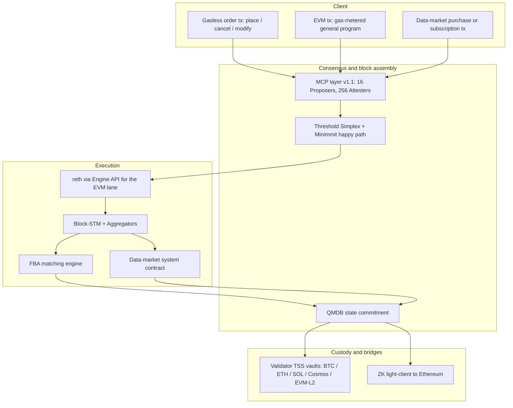

# UltraFast: An Economic Operating System

## Abstract

UltraFast is a Layer 1 blockchain — an economic operating system that runs multiple workloads on one consensus, execution, and custody stack. The anchor workload is unified on-chain derivatives: perpetual futures and scalar prediction markets, served by a single matching engine and a single cross-product margin system, invoked through gasless turing-incomplete order transactions that bypass the EVM gas mechanism. A data sales market runs as a second native workload, settling subscription and per-query payments for on-chain feeds, datasets, and oracle products. Arbitrary user programs run on the standard EVM lane under gas-metered transactions. The architecture composes four production-evidenced components: Threshold Simplex consensus with the Minimmit single-round fast path [1, 2], the reth EVM execution client driven via the Engine API [3] with Block-STM optimistic concurrency [4] and Aptos-style aggregator primitives [5], an in-protocol Frequent Batch Auction (FBA) matching engine at a sub-second tick [6], and the QMDB state backend [7]. Matching MEV is addressed by composition rather than by a single primitive: a multi-concurrent-proposer (MCP) consensus layer [8] provides the selective-censorship resistance and hiding that any auction-based mitigation requires [9, 10], FBA collapses intra-tick ordering into a uniform clearing price, and a tokenized-ordering bolt-on [11] handles the few paths that bypass the batch. Performance targets are p50 finality near 200 ms and p99 near 300 ms on the Minimmit happy path with a two-region validator topology, degrading to a roughly 400 ms pessimistic-leader floor under standard Threshold Simplex fallback; achieved finality and throughput pending Phase 0 walking-skeleton validation. UltraFast is a chain, not a token launch: the native asset UFAST exists for staking, bonding, and governance, and the full stream of trading, data-market, listing, and EVM gas fees is denominated in Bitcoin and flows directly to stakers. Fee parameter values — trading-fee schedules, listing fees, data-market fees, and the EVM gas-price floor — are set by on-chain governance vote weighted by bonded UFAST stake; the protocol does not hard-code fee levels. Fees may be paid in any supported collateral token (USDC, USDT, ETH, MANTRA, and other accepted assets), converted to their BTC-denominated amount at a rate sourced from the on-chain matching engine or from a validator-set oracle. Each supported asset is custodied at a stake-weighted threshold-signature vault derived from the active validator set, using the signature scheme native to its source chain. Where a staker has bonded to a validator, the validator receives a configurable commission and the remainder flows to the delegator.

---

## 1. Introduction

### 1.0 Scope: an economic operating system, not a single-purpose chain

UltraFast is a Layer 1 blockchain that runs multiple workloads on a single consensus, execution, and custody stack — an economic operating system in the same sense that a general-purpose OS runs scheduling, memory management, and I/O for many user programs on shared hardware. Three workloads are first-class at v1:

1. **Derivatives.** Perpetual futures and scalar prediction markets, served by a single matching engine and a single cross-product margin system. Orders are submitted as gasless turing-incomplete typed transactions — `place`, `cancel`, `modify`, `batch-cancel`, `liquidate` — that bypass the EVM gas mechanism and are processed natively by the matching engine. The traded asset is fungible and the order semantics are bounded, so there is no need for arbitrary computation on the order path.
2. **Data sales market.** A native marketplace for on-chain feeds, datasets, oracle products, and computed metrics. Producers list access tiers (one-shot purchase, time-bounded subscription, per-query metering); buyers pay in any supported collateral; access is gated on-chain by the consumer's payment state, and entitlement is exposed via a system contract that other EVM programs can read in the same call frame they trigger downstream logic.
3. **General programs on the EVM lane.** Arbitrary user smart contracts under full Cancun-parity EVM semantics, gas-metered, parallelised under Block-STM (§6.2). The matching engine and the data marketplace are exposed to general programs through fixed system-contract ABIs; this is the integration surface for vaults, structured products, liquidators, lending markets, and any other application that needs to read book state or settled data-market entitlements.

Fee parameters for all three workloads — taker and maker fees on the matching engine, per-query and subscription fees on the data marketplace, listing fees, and the EVM gas-price floor — are set by on-chain governance vote weighted by bonded UFAST stake (§13). The protocol does not hard-code fee levels; the genesis configuration is a starting point that governance can subsequently adjust.

The rest of §1 motivates the architecture against the derivatives workload because it is the most demanding by latency and matching complexity. The MEV stack (§8), the custody model (§10), the performance budget (§12), and the validator economics (§13) apply uniformly across all three workloads.

### 1.1 The derivatives workload

On-chain derivatives venues have closed most of the user-experience gap to centralised exchanges in throughput and latency, but they have done so by adopting trust assumptions that the original promise of decentralised finance was supposed to remove. Hyperliquid, the current market leader, operates a closed-source matching engine, a small team-controlled validator set, a stake-weighted multi-signature bridge, and a public mempool from which order content is extractable in advance. Other venues either inherit the Cosmos SDK execution stack (with the recurring gas-refund and precompile-atomicity bug class catalogued in advisory GHSA-mjfq-3qr2-6g84 [12]) or split matching off the chain entirely, re-introducing operator trust.

UltraFast targets the same latency and throughput envelope through a different composition. The chain provides:

1. **Sub-second finality at CEX-competitive cost** by pairing Threshold Simplex with Minimmit's single-round fast path on a curated, latency-optimised validator topology, with speculative execution against the proposal to mask consensus latency from the user-facing fill path.
2. **MEV resistance by construction** through an ordered three-layer stack: MCP at the consensus layer for censorship resistance and pre-trade hiding, in-protocol FBA at the matching layer for uniform-price clearing within each tick, and a tokenized-ordering bolt-on for paths that necessarily bypass the batch (admin, governance, cross-chain message handlers).
3. **A single matching engine and a single margin system** serving both perpetual futures and scalar prediction markets co-equally, with cross-product margin offsets recognised at the engine level rather than at a wrapper layer.
4. **Gasless turing-incomplete order transactions** that decouple the trader's cost-to-trade from EVM gas-price volatility. Orders are processed as typed system operations rather than as EVM calls (§6.6); the only fees a trader pays are the governance-set trading fees, denominated in BTC, paid out of the account collateral at fill time.
5. **Open validator set and validator-operated custody** via threshold signature schemes (FROST [13] / ROAST [14] for Schnorr and Ed25519, DKLs23 [15] for ECDSA), complemented on the Ethereum corridor by a Succinct-style ZK light-client bridge [16] against UltraFast's QMDB state commitment.
6. **Honest performance disclosure**: every latency claim states its conditions, the pessimistic floor is reported alongside the happy-path target, and design decisions still under evaluation are listed as open rather than narrated as settled.

UltraFast is in the pre-implementation research and architecture phase at the time of this draft. Section 12 distinguishes target metrics from measured ones; Section 16 lists the design decisions still open; Section 14 tabulates the residual risks the architecture deliberately accepts at launch.

### 1.1 Contributions of this document

This document is a conceptual whitepaper, not a technical specification. It states the design intent, the composition of validated components, and the open questions, at the level of detail an institutional trader, a protocol engineer, or a security researcher needs to evaluate the approach. A formal specification (yellow paper) will follow once the Phase 0 walking-skeleton validates that the four most novel integrations compose within budget [see §16, Phase 0].

The document's contributions are:

- A composed-architecture argument: each layer is production-evidenced; the integration of these specific layers — Threshold Simplex with Minimmit, reth via Engine API with Block-STM and aggregators, FBA as an EVM system contract, QMDB as the state backend, MCP as a v1.1 add-on — has not previously been shipped in one chain.
- An MEV stack in a fixed order (MCP, then FBA, then tokenized ordering) with residual vectors enumerated and honestly named rather than papered over.
- A unified-margin design for perps plus scalar prediction markets, with the cross-product risk model identified as an open design decision.
- A custody design that names what trust is removed (single-signer key control) and what trust remains (a `2f+1` stake-weighted quorum honest under bond-to-custody value capping).

---

## 2. System Model and Assumptions

This section states the assumptions on which every subsequent section depends. No later claim may rely on an assumption not introduced here.

**Network synchrony.** The network is partially synchronous with an unknown Global Stabilisation Time (GST). After GST, message delays between honest validators are bounded by a known $\Delta$. Before GST, messages may be arbitrarily delayed. Threshold Simplex and Minimmit both provide safety under asynchrony and liveness after GST [1, 2].

**Adversary model.** Let $n$ denote the validator count and $f$ the count of Byzantine validators. The standard safety bound is $f < n/3$. Minimmit's single-round fast path requires the stronger $f < n/5$ — equivalently, at least $4f+1$ honest validators, or equivalently $n \geq 5f+1$. When the $5f+1$ quorum is unmet (e.g. under unusual partition or targeted attack), the protocol falls back to standard Threshold Simplex at $n \geq 3f+1$.

Corruption is static: the adversary fixes the set of Byzantine validators before protocol execution. The adversary controls Byzantine validators' messages, scheduling within the bound $\Delta$ after GST, and the contents of any message it chooses to broadcast. It does not break standard cryptographic primitives.

**Cryptographic assumptions.** BLS12-381 pairing-based signatures [17] are assumed unforgeable under the standard pairing assumptions. The random oracle model is used for hashes invoked by the consensus and TSS protocols. FROST, ROAST, DKLs23 and CGGMP21 [18] are each assumed secure under the assumptions stated in their respective papers, including identifiable abort under protocol deviation.

**Validator-set composition.** At v1 launch, the validator set is curated at $n = 30$, with equal voting weight in the consensus layer and a separate stake-weighted accountability layer for slashing (see §13). The set expands per the milestones in §13.

**Finality semantics.** A block is final once the Threshold Simplex threshold-signature certificate for that view is produced. On the Minimmit happy path this occurs after a single round; under fallback to standard Simplex it requires the standard two-round commit. State produced under speculative execution (see §6.4) is not final until the corresponding certificate lands; deterministic rollback applies on view skip.

**Trust statements made explicitly.** No claim of "trustlessness" appears in this document without naming what trust is removed and what remains. Specifically:
- Consensus safety holds under the Byzantine bound stated above; liveness holds after GST under the same bound.
- Bridge custody removes single-signer key control; it retains the assumption that a `2f+1` stake-weighted validator subset, weighted as described in §10, does not collude. The bond-to-custodied-value ratio described in §10 is the economic complement to this assumption.
- The matching engine eliminates intra-tick ordering MEV; residual MEV vectors (temporal across batches, cross-domain, oracle) are enumerated in §8.

---

## 3. Architecture Overview

Figure 1 summarises the layered architecture. Time and data flow top-to-bottom.

**Figure 1.** UltraFast layered architecture. Three transaction types enter the chain: gasless turing-incomplete order transactions for the derivatives workload (§6.5), gas-metered EVM transactions for general user programs (§9.5), and data-market purchase or subscription transactions for the data-sales workload (§9.4). All three enter the MCP layer (at v1.1) or directly into the Threshold Simplex proposer pool (at v1), are sequenced into blocks, and executed in reth under Block-STM with aggregator primitives for hot-key commutativity. Derivatives orders clear through the in-protocol FBA matching engine at the tick boundary; data-market transactions are processed by the data-market system contract; general EVM transactions run under standard gas-metered semantics. State is committed to QMDB. Bridge custody is co-operated by the validator set via TSS, with a complementary ZK light-client bridge on the Ethereum corridor.

The remainder of this document treats each layer in detail: consensus (§5), execution (§6), matching (§7), MEV resistance (§8), workloads and margin (§9), bridges (§10), privacy tiers (§11), performance (§12), economics and validators (§13), security (§14), related work (§15), open decisions (§16), and future work (§17).

---

## 4. Notation Summary

Symbols used in this document. A full notation table appears in Appendix A.

- $n$: total validator count.
- $f$: count of Byzantine validators.
- $\Delta$: known message-delay bound after GST.
- `GST`: Global Stabilisation Time (unknown).
- `tick`: the FBA tick interval, target 100 ms locked to block cadence.
- `view`: a Threshold Simplex view (the unit of leader rotation).

---

## 5. Consensus

The consensus layer provides total order over blocks under partial synchrony with the assumptions of §2. Two protocols compose to give the latency target without sacrificing the safety floor: Threshold Simplex [1] as the base, and Minimmit [2] as a single-round fast path.

### 5.1 Threshold Simplex

Threshold Simplex is the Commonware refinement of Chan and Pass's Simplex protocol [1]. Validators run a one-time distributed key generation (DKG) to produce a shared BLS12-381 threshold secret. Every consensus message is a partial signature on the view's proposal; once $2f+1$ partial signatures arrive, the validators aggregate into a single threshold-signature certificate of about 240 bytes per view, verifiable against a static public key that survives validator-set churn through resharing.

Message complexity per round is $O(n)$ partials produced, $O(n)$ communication for the broadcast, and one $O(1)$ certificate per finalised view. Verification cost on the certificate is constant in $n$ — a single threshold-signature check — which is the property that makes the protocol practical for the validator-set sizes of §13.

**Safety.** Under partial synchrony with $f < n/3$ Byzantine validators, two distinct certificates for the same view cannot be produced — production of either requires $2f+1$ honest-or-Byzantine partials, and the intersection bound forbids two such sets to disagree.

**Liveness.** After GST, leaders rotate per a known schedule; a view that fails to reach $2f+1$ partials within a timeout is skipped, and the next leader proposes. Eventual liveness follows from the standard partial-synchrony argument.

### 5.2 Minimmit

Minimmit [2] is the Commonware single-round fast-path variant. When at least $4f+1$ validators participate honestly in a view — equivalently $f < n/5$ — finalisation occurs in a single round rather than the two rounds of standard Simplex. At the v1 launch validator count of $n = 30$ on a curated bonded set with no expected Byzantine validators, the $5f+1$ quorum is satisfied by construction and the happy path applies.

When the $5f+1$ quorum is unmet — e.g. under a cross-region partition that strands more than $f$ validators, or under a targeted attack — the protocol falls back automatically to standard Threshold Simplex at $n \geq 3f+1$. The chain does not halt; it degrades to the pessimistic-floor latency of §12.

### 5.3 Stake-weighting

Commonware's threshold aggregation is count-quorum, not stake-quorum: the threshold signature scheme aggregates $2f+1$ partials regardless of the underlying stake those signers hold. UltraFast's v1 set is therefore curated equal-weight, with a separate stake-weighted accountability layer (§13) that converts equivocation evidence and protocol-deviation evidence into slashing actions weighted by bonded stake. This is an explicit v1 simplification; alternatives (virtual-share / weighted DKG, Aptos-style stake normalisation) were considered and rejected for v1 on implementation-cost grounds.

### 5.4 QMDB state backend

QMDB [7] is an append-only key-value plus Merkle store organised as immutable subtrees ("twigs"). It exposes a single SSD read per state access, $O(1)$ I/O for updates, and in-memory Merkleisation at approximately 2.3 bytes per entry. This profile suits the perpetuals churn pattern — heavy writes concentrated on a few hot markets — better than reth's stock MDBX + hexary Merkle-Patricia Trie combination, which becomes I/O-bound at the throughput targets of §12.

QMDB is integrated as a state-DB shim implementing reth's state-DB trait surface. EVM hexary-trie semantics remain exposed to user contracts via the standard `eth_getProof`-style RPCs; the twig storage operates underneath. Ethereum-MPT-root compatibility is not a v1 requirement, because Foundry, standard wallets, and Solidity tooling depend on EVM execution semantics rather than on the state-root format.

### 5.5 Why not HotStuff, CometBFT, or DAG

Standard HotStuff variants [19, 20] suffer pessimistic-leader latency approximately six times worse than Simplex on the same network under the comparison published with the original Simplex work [1]. CometBFT's `ProcessProposal` lifecycle imposes a transaction-processing model that interferes with FBA's tick-boundary semantics and with the MCP layer's pslice assembly. DAG-based protocols (Narwhal/Bullshark/Mysticeti [21, 21b, 22]) trade three- to six-fold latency for throughput gains UltraFast does not need at v1 scale, and they sacrifice deterministic intra-block ordering — disqualifying for a CLOB that depends on tick-boundary semantics.

---

## 6. Execution

The execution layer runs the EVM via reth [3] driven through the Engine API, with Block-STM optimistic concurrency [4] for parallelism, Aptos-style aggregator primitives [5] for hot-key commutativity, and speculative execution against the proposal to mask consensus latency.

### 6.1 reth via Engine API

UltraFast drives stock reth via `engine_newPayloadV*`, `engine_forkchoiceUpdatedV*`, and `engine_getPayloadV*` — the same architectural shape Tempo [23] and Monad [24] have converged on. This inherits the Ethereum tooling stack (Foundry, Hardhat, Etherscan, every standards-compliant wallet) without modification, presents the lowest audit surface among the considered execution paths, and avoids the Cosmos-EVM bug class catalogued in advisory GHSA-mjfq-3qr2-6g84 [12] (CVSS 8.3; `Run` methods not atomic; deferred `HandleGasError` failing to revert StateDB on out-of-gas; allowing partial-state-write claims). The same bug class previously affected Evmos.

EVM compatibility level is full Cancun parity. Custom precompiles exist only for matching-engine reads, oracle reads, and the aggregator surface — never for state mutation, the property whose violation produced the Cosmos-EVM bug class.

### 6.2 Block-STM

Block-STM [4] is the optimistic concurrency-control protocol introduced by Aptos. Transactions within a block execute speculatively in parallel; conflicts are detected via read-write set comparison; conflicting transactions are aborted and re-executed in dependency order. Under low contention, Block-STM achieves near-linear speedup in core count.

Vanilla Block-STM degrades toward sequential execution under hot-key contention — the canonical perp-DEX pathology, in which one funding accumulator per market, one fee accumulator, and one insurance fund attract concurrent writes that all conflict on the same storage slot.

### 6.3 Aggregator primitives

Aggregator primitives [5] address the hot-key pathology. They lift the `SLOAD; ADD; SSTORE` pattern to a typed `Incr(key, delta)` operation that the runtime knows to be commutative. Two concurrent `Incr` operations on the same key do not trigger a Block-STM abort: they commute.

UltraFast exposes the aggregator surface day-1 for system contracts: CLOB fee accumulator, funding accumulator, insurance fund, vault share supply, and the builder-code accumulator. A general-contract surface (via a custom precompile plus a Solidity library) is an open design decision (see §16).

Supported operations are `add`, `sub`, `read`, and `read_with_overflow_check`. Reads materialise the current value and force a serialisation point — acceptable at tick boundaries, rare in mid-tick paths. The overflow policy is a hard cap at $u128$: an over-cap operation aborts rather than silently saturating.

### 6.4 Speculative execution

Speculative execution closes the remaining gap between consensus finality and user-perceived fill latency. reth begins executing the proposal on `engine_newPayload` before the threshold-signature certificate arrives. The QMDB state-root commit gates on finality. If Threshold Simplex skips the view, the speculative state is discarded deterministically before the next proposal.

This is the third lever in the latency budget of §12. Without it, even the combination of Minimmit and a two-region topology produces p50 finality in roughly the 280–320 ms range; with it, the target moves to approximately 200 ms p50. The Phase 0 walking-skeleton (§16) validates that the speculative-commit and rollback paths are deterministic and that no observable state mutation under speculation escapes to the user before finality lands.

### 6.5 Gasless turing-incomplete order lane

Orders to the matching engine enter UltraFast through a dedicated transaction lane that bypasses the EVM gas mechanism entirely. The lane supports a fixed set of typed operations: `place`, `cancel`, `modify`, `batch-cancel`, and `liquidate`. Each operation has a fixed parameter schema, a bounded effect on the orderbook and account state, and no scripting surface. The lane is in this sense turing-incomplete: the only state transitions it can express are those the matching engine itself defines.

Why gasless: pricing every order at the EVM gas-price floor would couple a market maker's quote refresh cost to unrelated EVM-lane demand. Market makers at v1 may quote tens of thousands of orders per minute across the supported markets, and pegging that volume to gas-price volatility produces a cost surface institutional makers will not accept. The lane processes orders without per-transaction gas accounting. The only fee a trader pays is the governance-set trading fee (§13), deducted from account collateral at fill time and denominated in BTC.

Why turing-incomplete: the matching engine processes fungible derivative orders with bounded effects, so there is no need for arbitrary computation on the order path. Removing the scripting surface eliminates an entire class of attack vectors — re-entrancy, gas-griefing, opcode-specific bugs — that have repeatedly produced incidents on EVM-native order venues. EVM contracts that need to express conditional logic ("place this order only if mark price is below $X") submit a gas-metered EVM transaction that calls into the system contract surface (§6.6), paying gas for the conditional evaluation and incurring no gas on the resulting order itself.

Each gasless transaction is authenticated by an EIP-712 signature against the account's keyset, replay-protected by a per-account monotonic nonce, and sequenced through the MCP pslice path (§8.1) at v1.1. Gasless transactions and EVM transactions enter Threshold Simplex blocks side by side; the block builder demarcates the two lanes for the executor, and the FBA solver processes the demarcated order set at the tick boundary (§7).

Liquidations are emitted as gasless transactions by the protocol's liquidation engine itself rather than by a user. Their effect is bounded to a single account and a defined set of orderbook entries; they incur no fee and no slashable cost beyond the standard liquidation penalty (§9.1).

### 6.6 CLOB exposure to EVM contracts

The matching engine is also exposed to EVM contracts via a fixed system-contract ABI. User contracts (vaults, lending markets, liquidators, structured products) read book state synchronously in the same call frame that triggers their downstream logic: best bid, best ask, depth at level, mark price, last clearing price, funding-rate snapshot. EVM contracts may also submit orders through the system contract (`placeOrder`, `cancelOrder`, `modifyOrder`, `batchCancel`); these calls return synchronously with status `queued for tick T+1`, settlement events fire at tick close, and the order itself enters the same matching pipeline as gasless-lane orders with no fee differential at fill time. The calling EVM transaction pays gas for its own execution (conditional logic, parameter assembly, downstream effects); the resulting order incurs no additional gas charge.

This dual-entry pattern — gasless lane for raw order flow, EVM system contract for contract-mediated order flow — is the deliberate architectural alternative to Hyperliquid's HyperCore-to-HyperEVM async seam. A vault that needs to read the orderbook before deciding whether to rebalance can do so in one transaction frame, rather than marshalling state across a boundary it does not control.

If the FBA solver fails to clear within tick budget, queued orders revert atomically — gasless-lane and EVM-lane orders alike. No FIFO fallback is provided; a FIFO fallback would re-introduce the ordering MEV the FBA tick is designed to eliminate.

---

## 7. Matching: Frequent Batch Auctions

The matching engine is an in-protocol Frequent Batch Auction (FBA). All orders within a tick clear at a uniform price per market, with pro-rata fills at the clearing price level. The economic foundation is the Budish-Cramton-Shim argument [6] that continuous-time matching produces a sniping equilibrium harmful to liquidity providers, and that discrete-time batch matching eliminates that equilibrium.

### 7.1 Tick mechanics

The default tick parameter is 100 ms, locked to consensus cadence. A tick that closes after the next block is finalised re-introduces a round-trip the architecture explicitly removes, so the tick interval must not exceed the block interval. A 100 ms tick paired with Minimmit's single-round commit is the natural pairing; the solver budget at p99 must be no more than 20 % of the tick (no more than 20 ms) to maintain that pairing under realistic load. Other tick values (150 ms, 200 ms) remain under evaluation — see §16.

For comparison, Penumbra's ZSwap auction runs at approximately 5-second blocks [25], and CowSwap's off-chain batch auction at approximately 30-second blocks [26]. UltraFast's tick is one to two orders of magnitude tighter, sized to a CEX-competitive perpetuals workflow rather than to the asset-swap workflow those venues target.

### 7.2 Clearing rule

Within each tick and for each market, the engine computes the single uniform price at which aggregate buy quantity equals aggregate sell quantity, ignoring any further increment in price. At that price, all crossing orders fill — pro-rata at the marginal level — and the post-only carry policy (§7.4) determines what remains on the book for the next tick.

Uniform-price clearing has two operational consequences that the user experience must reflect. First, all orders that cross at the tick fill at the same price; there is no per-order price discovery within the tick. Second, no fill is reorderable within the tick: the clearing computation is invariant to the order in which the engine received the contributing orders.

### 7.3 Order types

Native order types are limit, market, immediate-or-cancel (IOC), fill-or-kill (FOK), and reduce-only. Post-only orders are awkward in a pure batch semantics — there is no continuous book against which to "post" — and the v1 design either omits them or supports them via a tick-pre-commit conditional-reveal pattern, an open decision in §16. Cancels processed in a tick are zero-cost within that tick; this protects market makers from the cancel-tax pathology of strictly time-priority venues.

### 7.4 Carry-versus-expire policy

The default policy is: limit orders carry to the next tick until filled or cancelled; auction-style orders (IOC, FOK, market) expire at tick close if unfilled. Alternative policies (all-expire, per-order-type configurable) remain under evaluation in §16. The carry-versus-expire choice has direct consequences for market-maker reasoning and is one of the levers MM partners will exercise feedback on before v1 launch.

### 7.5 Solver location

The FBA solver runs as an in-validator native module, called from the system contract at tick boundary — following the Speedex precedent [27] of solver-in-validator rather than solver-in-VM-precompile. FBA operates at block level rather than transaction level, so the solver does not fit cleanly into a per-transaction precompile model. Whether this placement should change at scale is an open question deferred to post-Phase-0 benchmarking.

### 7.6 Shared engine for perps and prediction markets

The same FBA engine serves both perpetual futures and scalar prediction markets. Uniform clearing price is computed independently per market; no scheduling or sequencing is shared across markets within a tick. Both product types receive the same MEV protections (§8) as a consequence of using the same engine.

---

## 8. MEV Resistance

MEV resistance in UltraFast is provided by three composed layers, presented here in the fixed order: (i) MCP at the consensus layer, (ii) FBA at the matching layer, and (iii) tokenized ordering for un-batched paths. Every section of this document that lists the layers lists them in this order, because the order reflects a dependency: FBA's fairness reduces to "trust the leader" unless MCP underneath provides selective-censorship resistance and hiding, and the theorem of [9] holds that any auction-based mitigation requires those two properties from the consensus it sits above.

### 8.1 Layer 1: Multi-Concurrent-Proposer (MCP)

The MCP layer is modelled on the Solana Constellation pattern [8]. Approximately 16 stake-weighted Proposers accept transactions in 50 ms cycles and assemble *pslices*, each erasure-coded into 256 *pshreds* — one per Attester. The 256 Attesters sign attestations on the pshreds they receive. The Threshold Simplex leader for the view assembles a block from pslices that crossed at least 40 % attester support; a block is structurally invalid if total attestation falls below 60 %. Censoring an attested pslice produces an invalid block — the enforcement is architectural rather than slashing-based.

What MCP solves: hard selective censorship (by IP, fee level, deposit pattern). What MCP does not solve: content visibility post-deadline (Proposers see plaintext transactions in the standard pipeline; redundant submission to multiple Proposers widens content exposure as the price of censorship resistance), and timing or late-message attacks. The FBA tick (§8.2) is the complement that makes whatever the Proposers see semantically un-front-runnable.

**Rollout timing.** UltraFast ships v1 with single-proposer Threshold Simplex and adds MCP at v1.1, once a production Constellation implementation (or a comparable alternative) is available and we have validated latency on testnet. This is a deliberate decision documented in §16: the v1 window carries a residual selective-censorship risk that is mitigated by aggressive leader rotation, timeout-skip rules for orphaned proposals, and wallet-level retry-from-different-mempool-entrypoint UX. The risk is named explicitly in §14 rather than papered over.

### 8.2 Layer 2: Frequent Batch Auctions

FBA collapses every transaction that touches a market within the tick into a single uniform-price clearing, with pro-rata fills at the marginal level (§7). Within a tick, reordering is semantically meaningless: the clearing price and the fill allocation are invariant under permutation of the contributing orders. This eliminates intra-tick sandwich attacks, intra-tick classic front-running, and intra-tick time-boost MEV — the three highest-value categories of MEV at perpetual-futures venues.

The residual MEV vectors that FBA does not eliminate are catalogued in §8.4.

### 8.3 Layer 3: Tokenized ordering bolt-on

A small set of paths necessarily bypass the FBA tick: administrative transactions, governance executions, cross-chain message handlers. For those paths UltraFast adopts the Masquerade [11] tokenized-ordering pattern: strictly increasing serial-numbered tokens enforce a deterministic ordering invariant for transactions outside the batch. The bolt-on scope (admin only versus admin plus cross-chain message handlers versus general-purpose) is an open decision in §16; the design intent is to kill the bolt-on if FBA covers all paths in production.

### 8.4 Residual MEV vectors

We name the residuals explicitly per [10]:

- **PBS-layer extraction**: not applicable — UltraFast runs no proposer-builder separation.
- **Temporal MEV** across batches: a proposal-to-execution gap exists even at sub-second tick. The sub-second tick mitigates the size of the extractable surface; it does not zero it. Cross-tick statistical arbitrage between markets is a feature of efficient markets, not a protocol exploit.
- **Cross-domain MEV**: information edges across chains exist whenever UltraFast trades an asset that also trades elsewhere. This is irreducible to a single chain's protocol.
- **Oracle MEV**: any price feed used in margin computation creates a window between oracle update and consequent liquidation. Mitigations are standard (TWAP smoothing, decentralised oracle committee, dispute mechanism) and are deferred to §17 for the prediction-market oracle in particular.

### 8.5 Why not a threshold-encrypted mempool

Threshold-encrypted mempools — Shutter [28], Ferveo [29], the TrX construction of ePrint 2025/2032 [30] — are an active research direction and a serious option in the encrypted-order-flow design space. UltraFast explicitly rejects them for v1 with stated reasons:

- Production transaction-to-inclusion latency on Shutter-protected Gnosis is in the minute-scale range, incompatible with a sub-second perpetuals path.
- EIP-8184 and EIP-8209 add at least one slot of latency to inclusion.
- Committee halt risk: a threshold-decryption committee that loses liveness halts inclusion. This is incompatible with a venue where missed price ticks during stress are the highest-stakes liveness failures.

UltraFast targets v2 for re-evaluation, contingent on committee-liveness budgets reaching sub-100 ms. The Ferveo-style approach remains an option for an opt-in lane parallel to the public path. See §16 for the open decision and §17 for the v2 path.

---

## 9. Workloads

UltraFast supports three workloads at v1. The derivatives workload covers perpetual futures and scalar prediction markets, served by the FBA matching engine of §7 and the unified margin system of §9.3, invoked through the gasless turing-incomplete order lane of §6.5. The data sales workload covers feeds, datasets, and oracle products (§9.4). The general-programs workload covers arbitrary user smart contracts on the EVM lane (§9.5). All three workloads share the same consensus, custody, MEV stack, and validator economics. The derivatives workload is treated first because it sets the latency budget that the rest of the architecture is sized against.

Within the derivatives workload, perpetual futures and scalar prediction markets are co-equal first-class products. Both products are served by the same FBA matching engine (§7) and the same unified margin system (§9.3).

### 9.1 Perpetual Futures

UltraFast lists perpetual futures (no expiration, continuous-price contracts with periodic funding payments). The funding mechanism is the standard premium-index funding rate paid periodically between longs and shorts to anchor contract price to oracle spot.

- **Listed asset classes** at v1: crypto perpetuals (BTC, ETH, SOL, MANTRA) on a permissionless-after-audit-milestone basis; RWA perpetuals (gold, equities, FX, treasury yields) on a compliance-gated basis, sourcing price feeds via the MANTRA RWA ecosystem.
- **Leverage**: up to 50× on crypto perps, up to 20× on RWA perps, with per-asset-class caps configurable by governance.
- **Liquidation**: gradual liquidation engine with an insurance fund backstop. Liquidation penalties route 100 % to the insurance fund, separate from the trading-fee distribution of §13.
- **Collateral**: USDC as the primary settlement asset, with MANTRA, native BTC / ETH / SOL (held in the validator-operated TSS vaults of §10), yield-bearing assets (stATOM, stETH), and MANTRA RWA tokens accepted as additional collateral.
- **Listing**: the HIP-3-equivalent system contract (§9.6) governs builder-deployed perpetual markets; builders post a UFAST stake bond and earn a configurable share of fees from their markets, with the bond slashable for oracle manipulation, malformed funding, or failed-liquidation cascades attributable to market-config errors.

### 9.2 Scalar Prediction Markets

UltraFast lists scalar prediction markets — range-based event contracts that settle proportionally within a `[min, max]` bound, with payout formula

$$
\mathrm{payout}(R) = \mathrm{clip}\left( \frac{R - \mathrm{min}}{\mathrm{max} - \mathrm{min}},\ 0,\ 1 \right)
$$

where $R$ is the resolved event outcome.

- **Why scalar before binary**: scalar markets produce smoother price paths than binary markets, which enables modest leverage (5–10×) without the catastrophic gap-liquidation risk that a binary flip from probability 0 to probability 1 produces. A CPI print moving from 3.5 % to 4.0 % in a [2 %, 6 %] range moves the contract price from 0.375 to 0.50 — a manageable shift for a 5× position. A binary print on the same event would price-shift by a full unit, wiping any leveraged position.
- **Expiration**: fixed, tied to event resolution.
- **Funding rate**: an open design decision. Three candidates are under evaluation: oracle-anchored (reference external probability estimates), pure market-driven (no anchor), and hybrid. The fundamental challenge is that no natural "spot" exists for event probability — see §16.
- **Boundary liquidation**: also an open design decision (§16). Three candidates are under evaluation: standard perps-style liquidation, gradual de-leveraging as a contract approaches a boundary, and auto-close at boundary approach.
- **Resolution**: an optimistic oracle with an economic bond and a dispute path, modelled on UMA's approach to subjective-event resolution. Specific oracle selection is itself open (§16).
- **Deployment**: permissionless on a stake-gated basis once the initial scalar liquidation mechanics are validated against live flow.
- **Binary markets** are deferred to a later release once the scalar liquidation engine is battle-tested.

### 9.3 Unified Cross-Product Margin

The capital-efficiency thesis of UltraFast is that a single trader account holds both perpetual-futures and scalar-prediction-market positions in one collateral pool. When two positions hedge each other across products — for example, a long ETH perp against a short "ETH below \$X" scalar contract — the margin engine recognises the hedge and reduces the total margin requirement below the sum of the two individual requirements.

The cross-product risk model is an open decision (§16). Three candidates are under evaluation:

- **Portfolio margin** (correlation-based netting): most capital-efficient under correctly-estimated correlations; hardest to specify, hardest to audit, and hardest to prove under privacy.
- **Additive offsets**: capital-conservative, simple to specify, smallest cross-product benefit.
- **SPAN-style risk arrays**: the futures-industry standard; intermediate complexity; well-understood operational track record.

Until the choice is made, this whitepaper states the design intent (unified margin, with cross-product offsets recognised at the engine layer) without committing to the risk-model specifics.

**Settlement asset.** A single stablecoin denomination across all products — USDC at v1.

**Failure-isolation property.** Liquidation of one position triggers margin recalculation across the account but does not propagate liquidation to unrelated positions outside the cross-margin set. The risk-engine specification (deferred to Phase B per §16) will state this property formally.

### 9.4 Data Sales Market

UltraFast runs a native data sales market as a second workload, served by a dedicated system contract on the EVM lane and settled in the same BTC fee distribution path as the derivatives workload. The market's purpose is to give on-chain producers — oracles, index providers, statistical-arbitrage feeds, RWA reference rates, computed risk metrics — a contract-mediated way to charge for access without negotiating bilateral agreements off-chain.

**Listing.** A producer registers a dataset by deploying a `DataProduct` contract that declares: the data schema (a typed record format), the access tiers offered, the price per tier (in BTC-denominated terms, payable in any supported collateral), the payout schedule (immediate vs vesting), and the dispute policy. Listing requires a UFAST stake bond, slashable for misrepresentation of the data product (declared schema not matching the actual delivery, declared SLA not met, materially misleading metadata). The bond size is set by governance and scales by claimed data-product class — uncurated free-form data products carry a small bond; oracle products that other contracts may depend on carry a larger bond and an audit gate.

**Access tiers.** Three tier classes are supported at v1, each with its own settlement semantics:

- **One-shot purchase.** A buyer pays a fixed BTC-equivalent price; the contract emits an entitlement event the producer can read to release a one-time delivery (typically a dataset hash, decryption key, or signed payload). The on-chain record is the auditable proof of purchase.
- **Time-bounded subscription.** A buyer pays for a window (hourly, daily, monthly); the contract maintains a per-buyer expiry timestamp. Other EVM contracts read the entitlement state via a system-contract call in the same frame they process downstream logic ("is account X currently subscribed to feed Y?"), and pay gas only for the gating check rather than for a remote call to an off-chain entitlement service.
- **Per-query metering.** A buyer pre-funds a balance; each query against the data product debits a unit. The producer reports per-query consumption in batched commit transactions that the contract checks against attestation rules before debiting. Per-query is the dominant model for high-frequency feeds where flat subscription overcharges low-volume consumers.

**Settlement.** Buyer payments accrue to the data product's `DataProduct` contract; the producer withdraws periodically per the contract's payout schedule. The protocol takes a governance-set data-market fee (zero at genesis, with upper-bound cap set by §13) which routes to the trading-fee distribution module described in §13.1 and flows in BTC to stakers alongside the derivatives trading fees.

**Privacy.** Three privacy tiers are supported:

- **Public delivery.** The data is delivered on-chain in cleartext; the on-chain record is itself the data. Suitable for indices, reference rates, and any data that has no embedded confidentiality.
- **Encrypted-to-buyer delivery.** The producer publishes the data encrypted under a per-buyer key derived from the buyer's account keyset; only the paying buyer can decrypt. The on-chain record is the ciphertext and the integrity attestation.
- **Off-chain delivery, on-chain entitlement.** The on-chain `DataProduct` exposes only the entitlement state and the integrity attestation; the actual data is served off-chain (HTTPS endpoint, IPFS pointer, or producer-operated relay) and the off-chain server checks entitlement against the on-chain state. This is the dominant pattern for large datasets (gigabyte-scale time series, machine-learning training sets) where on-chain delivery is prohibitive.

**Dispute.** Buyers can challenge a delivery as not matching the declared schema or SLA within a configurable dispute window. Challenges are arbitrated by the same optimistic-oracle path used by scalar prediction markets (§9.2) — the dispute oracle decision is the residual trust point in the data-market design and is one of the open decisions in §16.

**MEV protections.** The data-market entitlement state is exposed via a system contract under the same MEV stack that governs the derivatives workload: MCP at the consensus layer (§8.1) prevents selective censorship of data-purchase transactions, and tokenized ordering (§8.3) governs the few admin paths that bypass MCP (producer registration, governance fee changes). Entitlement reads from EVM contracts read the committed state at the start of the calling tick; entitlement writes (purchase, subscription renewal) flow through the same FBA-tick-boundary commit path as derivative orders, so a buyer's purchase cannot be front-run by an observer of the pending transaction.

**Why on-chain.** The argument for an on-chain data marketplace is not that on-chain matching is faster than an HTTPS API; it is that on-chain settlement is the only path that gives a producer auditable receivables without per-customer billing infrastructure, gives a buyer cryptographic proof of payment without trusting a centralised invoicing system, and gives a third-party EVM contract (a vault, a structured product, a lending market) a way to read entitlement state in the same frame it processes a trade — without trusting an off-chain entitlement service or signing a long-form data-licence agreement.

### 9.5 General Programs on the EVM Lane

UltraFast runs a full-Cancun-parity EVM lane (§6.1) on which arbitrary user smart contracts execute under standard gas-metered transactions, parallelised by Block-STM (§6.2) with aggregator primitives (§6.3) available for hot-key contention. Custom precompiles cover matching-engine reads, oracle reads, the aggregator surface, and the data-marketplace entitlement surface — never state mutation, the property whose violation produced the Cosmos-EVM bug class catalogued in advisory GHSA-mjfq-3qr2-6g84 [12].

The intent of the EVM lane is composability: any program that wants to read the orderbook, place orders contingent on conditions, settle data-market entitlements, or compose strategies across the derivatives workload and the data marketplace runs here. Vaults, lending markets, structured products, liquidation bots, builder-code aggregators, and the protocol's own listing primitives (§9.6) and Community Vault (§9.7) are all EVM contracts.

EVM-lane fees are gas-metered against a governance-set gas-price floor (§13). The gas-price floor exists to throttle adversarial workloads from saturating execution budget; ordinary user programs pay gas at the prevailing fee market on top of the floor. The same BTC-denominated payment-currency-conversion mechanism that applies to derivatives trading fees (§13.1) applies to EVM gas: gas is denominated in BTC at the protocol layer and payable in any supported collateral at the conversion rate of the immediately preceding tick.

### 9.6 Listing Primitives

Three system contracts on the EVM lane govern market deployment:

- **HIP-1-equivalent token issuance**: permissionless deployment of a new asset via a Dutch auction whose proceeds pay deploy gas. Auction-proceeds destination (burned vs treasury) is open in §16. Minimum bond and per-deployer rate-limiting throttle spam.
- **HIP-2-equivalent native MM seeder**: an on-chain bootstrap-MM contract per market, posting a fixed two-sided spread (Hyperliquid's HIP-2 uses 0.3 %) that refreshes every few seconds against an oracle mark. Removable by governance once organic depth crosses a configurable threshold.
- **HIP-3-equivalent builder-deployed perps**: as in §9.1, with builder stake bonds and configurable fee shares.

Curation is governance-gated per asset *class*: crypto perps permissionless once the audit milestones of §16 are met; RWA perps gated on compliance clearance. Per-class leverage caps and liquidation-tier bands address the risk-management implications (e.g. a meme-coin perp at 50× could in principle exhaust an insurance fund if uncapped).

### 9.7 Community Vault

UltraFast's protocol-owned-liquidity vault is multi-strategy from day 1, rather than monolithic. Hyperliquid's HLP is the existence proof that a monolithic vault scales to roughly \$500M before its risk-isolation properties bind. Segmenting strategies lets total vault TVL scale without diluting per-strategy Sharpe ratio and isolates drawdown to its originating strategy.

- **Strategy interface**: each strategy is a contract implementing `deposit`, `withdraw`, and `reportPnL`. Strategies are risk-isolated — one strategy's drawdown cannot cascade into another's collateral.
- **Initial strategies**: volatility-targeted market making, basis arbitrage (perp versus spot, or perp versus prediction-market), and a liquidation backstop. Additional strategies can be deployed by governance or third parties post-launch.
- **Share semantics**: ERC-4626-style transferable claims per strategy. A vault-of-vaults wrapper offers retail depositors a blended exposure.
- **Withdrawal policy**: an explicit per-strategy lock window (volatility-targeted may be daily; backstop weekly).
- **Capacity gating**: per-strategy on-chain capacity caps; deposits above cap route to the next-best strategy by the configured allocator.

---

## 10. Bridge and Custody

UltraFast accepts native deposits from external chains — Bitcoin, Ethereum and all EVM L2s, Solana, Cosmos — without wrapped-token intermediaries. The validator set jointly controls a vault address on each foreign chain via a threshold signature scheme. No single validator (or minority subset) holds a key; signing requires a `2f+1` stake-weighted quorum, matching the consensus safety bound.

The Bitcoin vault is the protocol's unit-of-account vault: trading and gas fees are denominated in BTC (§13.1), and after conversion all distributed yield is paid in BTC out of this vault. The address is derived from the active validator set via a stake-weighted distributed key generation: each validator $i$ runs $\lceil s_i / u \rceil$ FROST [13] keyshares, where $s_i$ is the bonded UFAST stake of validator $i$ and $u$ is the share-unit parameter calibrated to bound key-rotation cost. Spending any output requires a quorum of keyshares whose corresponding stake sums to at least $2f+1$ of total bonded stake. Stake-weighting therefore holds at the cryptographic layer of the BTC vault, not only at the accountability layer.

The same virtual-share construction applies to the Ethereum, Solana, Cosmos, and EVM-L2 vaults at v1, using the signature scheme native to each source chain (FROST for Ed25519 and Schnorr corridors, DKLs23 for ECDSA corridors, per §10.2). Any supported collateral asset may therefore enter UltraFast via its source-chain vault and serve both as trading collateral and as a fee-payment medium under the conversion rules of §13.1.

### 10.1 TSS protocol per cryptographic regime

| Foreign Chains | Curve / Scheme | TSS Protocol | Reference |
|---|---|---|---|
| Bitcoin Taproot, Solana, Cosmos Ed25519 | Schnorr / EdDSA | FROST [13] wrapped in ROAST [14] for robust liveness under aborters | `ZcashFoundation/frost` (Rust) |
| Bitcoin legacy / SegWit, Ethereum, all EVM | ECDSA secp256k1 | DKLs23 [15] (3-round, Paillier-free) | `silence-laboratories/dkls23` (Rust) |
| ECDSA fallback | ECDSA secp256k1 | CGGMP21 [18] (audited 2024–25, identifiable abort) | `LFDT-Lockness/cggmp21` (Rust) |

All three families are post-TSSHOCK [31] and support identifiable abort: protocol deviation is publicly attributable to a specific validator, enabling automated on-chain slashing under the slashing schedule of §13. GG18/GG20 [32] (used by THORChain and the original Multichain) is explicitly excluded; the TSSHOCK class of attacks against `tss-lib` derivatives makes it unsuitable for new deployments.

Whether to ship the mixed-protocol set above or to standardise on a single protocol via a universal scheme is an open decision (§16); the table above is the working assumption.

### 10.2 Distributed key generation

Every foreign-chain vault key is generated by the validator set via the protocol's native DKG: Pedersen DKG with verifiable secret sharing for FROST, protocol-specific DKG for DKLs23 and CGGMP21. No trusted dealer participates; no operator-held shards exist.

### 10.3 Validator-set rotation: fresh-wallet model

At each epoch boundary (e.g. monthly, or when validator-set churn exceeds a configured threshold), UltraFast generates a new TSS wallet on each foreign chain rather than resharing the existing key in place. New deposits route to the new address; the old wallet sweeps into the new one over a bounded window, then retires.

This is the tBTC v2 pattern [33], chosen over dynamic proactive secret sharing (CHURP, D-FROST) on the grounds that it sidesteps DPSS complexity, bounds the lifetime and the custodied value of any single wallet, and produces a cleaner audit story. The trade-off is the operational overhead of sweep-window tooling and deposit-address rollover; this is accepted. The rotation-model decision remains open in §16.

### 10.4 Bonded-stake-to-custodied-value ratio

Total bonded UFAST stake must be at least **2× total custodied value globally**, enforced by an on-chain deposit cap that throttles new inflows when bonded security is insufficient. This is THORChain's Incentive Pendulum [34] applied to a multi-asset vault: a `2f+1` stake-weighted collusion to steal foreign-chain assets is never profitable in expectation because the slashable bond exceeds the loot. Whether the ratio should be fixed at 2× or dynamic by asset-class volatility is an open decision (§16).

### 10.5 Foreign-chain bridge contracts

EVM and Solana-side smart contracts (deposit detection, withdrawal verification) are audited separately from the TSS layer. Withdrawals are subject to a dispute window with finaliser kill-switch, modelled on the Hyperliquid bridge pattern: a designated emergency multisig can pause the bridge during the window if a malicious withdrawal is detected, escalating to governance.

The dispute-window length is an open decision in §16. Bitcoin requires no smart contract — only TSS-signed transactions and an on-L1 deposit-detection watcher.

### 10.6 Ethereum-corridor ZK light-client bridge

For the Ethereum L1 corridor specifically — the highest-volume USDC inflow path — a Succinct-style ZK light-client bridge [16] runs alongside the TSS vault. The light-client proves UltraFast's state transition function on Ethereum and proves Ethereum's sync-committee state on UltraFast, replacing stake-bonded trust-minimisation with cryptographic finality on the corridor that carries the largest custodied value.

What the ZK bridge buys, precisely: Ethereum-side cryptographic certainty that whatever the UltraFast validators committed to, the state transition function was applied correctly. What it does not buy: protection against a `2f+1` validator collusion. A colluding `2f+1` subset can still censor or front-run; the ZK proof shows that they did not deviate from the rules they ran, not that the rules or the set are themselves decentralised. The ZK bridge complements the bonded-to-custodied-value cap; it does not replace it. This nuance is non-negotiable in marketing and audit communications.

Why Ethereum first: Ethereum is the largest USDC corridor, and the collusion attack surface is highest there. Other corridors (BTC, Solana, Cosmos, EVM-L2s) stay TSS-only in v1; some EVM-L2s already proof-bridge to Ethereum L1, so the UltraFast-to-Ethereum ZK path inherits their security transitively.

A force-withdrawal escape hatch in the L1 bridge contract activates after a documented timeout if validators stall, applying the same dispute-window-with-kill-switch policy as the TSS layer.

The prover hosting model (Succinct hosted with fee-revenue split, versus self-hosted, versus hybrid) is open in §16. The working assumption is Succinct-hosted at v1 with a self-hosted migration considered for v2 once volume justifies the capital expenditure.

### 10.7 Closest production analog

Chainflip [35] — 150 PoS validators, FROST across BTC/ETH/SOL/Polkadot/Arbitrum vaults — is the closest architectural reference. THORChain (GG20-based) and the Hyperliquid bridge (plain stake-weighted ECDSA multisig, not TSS) are existence proofs that the validator-controlled-vault pattern functions in production, but both are weaker designs UltraFast deliberately does not replicate.

---

## 11. Privacy Tiers

The MEV stack of §8 protects every trader from front-running and reordering without encrypting orders. Privacy beyond that — hiding *content* from validators or observers — is an opt-in tier rather than a baseline.

| Tier | Technology | What is hidden | Availability |
|---|---|---|---|
| **Lit (default)** | FBA + MCP | Nothing — orders, fills, positions visible on-chain | v1 |
| **Position-private** | Pedersen commitments + range proofs over positions and margin ratios | Position sizes, margin ratios, liquidation levels | targets v2 |
| **Dark pool (TEE)** | TEE-attested matching engine (Intel TDX [36] or AMD SEV-SNP), attested on-chain | Full pre- and post-trade order detail; on-chain settlement events leak size and price | targets v1.5 |
| **Dark pool (ZK + MPC)** | Collaborative-PLONK matching, Renegade-style [37] | Same as TEE tier, without enclave-vendor trust assumption | targets v2+ migration |

**Why TEE before ZK + MPC.** Renegade-style ZK + MPC matching is the strongest privacy guarantee available but currently adds tens to hundreds of milliseconds of proving overhead per match — too expensive to bootstrap a new venue against. TEE matching runs at sub-millisecond enclave latency with vendor attestation as the trust assumption. Once flow is bootstrapped on the TEE tier, the same volume can migrate to ZK + MPC without reopening venue economics. The TEE tier is staged in two phases (single-vendor, then multi-vendor with threshold-decrypt fallback) per §17.

The threshold-encrypted mempool option discussed in §8.5 is one possible v2 path; the privacy-tier framework above is independent of that decision.

---

## 12. Performance

This section consolidates the latency budget. Every number is stated with its conditions. Single-number latency claims are not made.

### 12.1 Latency targets

| Metric | Target | Conditions |
|---|---|---|
| Block / finality latency, p50 | ~200 ms | Minimmit happy path ($n \geq 5f+1$); 30 curated validators; two-region topology (US-East + EU-West, one-way RTT ~30 ms); speculative execution enabled; no Byzantine faults |
| Block / finality latency, p99 | ~300 ms | Same conditions as p50 |
| Block / finality latency, pessimistic floor | ~400 ms | Minimmit fallback to standard Threshold Simplex ($n \geq 3f+1$); cross-region partition or pessimistic leader; chain does not halt, degrades gracefully |
| FBA tick interval | 100 ms | Locked to consensus cadence; alternatives at 150 ms and 200 ms under evaluation per §16 |
| FBA solver runtime, p99 | $\leq 20$ ms | $\leq 20$ % of tick budget; benchmark gate for Phase A acceptance per §16 |
| End-to-end submit-to-fill, p95 (Phase 0 skeleton, four-validator two-region) | $< 300$ ms | Phase 0 exit criterion proving the 200 ms p50 / 300 ms p99 production target is reachable with headroom |
| End-to-end submit-to-fill, p95 (Phase 0 skeleton, four-jurisdiction soak) | $< 600$ ms | Phase 0 exit criterion proving graceful degradation to the pessimistic floor |
| Throughput headroom | 100 K+ orders/sec | Phase A end-to-end benchmark target; comparison reference is Hyperliquid's reported ~200 K ops/sec |
| Bridge withdrawal finality (Ethereum corridor, ZK light-client) | target minutes | Bound by Ethereum sync-committee period and prover SLA |
| MCP bandwidth budget per validator | $< 50$ Mbps | At projected throughput; measured target for v1.1 acceptance |

### 12.2 Pre-implementation framing

The targets above are design targets, not measured results. The chain is in the pre-implementation research and architecture phase at the time of this draft. Phase 0 — the walking skeleton described in §16 — is the validation gate that converts these targets into measured numbers. The Phase 0 exit criteria are:

1. End-to-end fill latency p95 below 300 ms on the four-validator two-region skeleton with Minimmit and speculative execution enabled.
2. End-to-end fill latency p95 below 600 ms on the four-jurisdiction soak with Minimmit fallback to standard Simplex.

Failure to hit either threshold points to the specific layer over budget before any product code is committed. If the gap between the two thresholds exceeds 2× consistently, the two-region launch-topology assumption requires re-evaluation.

### 12.3 Comparison framing

Hyperliquid reports approximately 70 ms finality on its current BFT implementation. UltraFast's 200 ms p50 target sits approximately 130 ms above that. The architecture treats this gap as the structural-fairness premium: MEV resistance by construction (§8), an open validator set (§13), and cross-product margin (§9.3). The trade is explicit; it is documented; it is offered to the market on those terms.

---

## 13. Economics and Validator Set

UltraFast is a chain, not a token launch. This section covers validator staking mechanics, fee flow, and the role of the native asset UFAST. It does not cover supply schedule, distribution, vesting, or any token-launch mechanic; those questions, where applicable, belong to the MANTRA ecosystem's existing tokenomics documentation and are deliberately not re-stated here.

### 13.1 Real yield, denominated in Bitcoin, with fee levels set by vote

The protocol unit of account for fees is Bitcoin. All fees — derivatives trading fees (taker and maker), data-market subscription and per-query fees (§9.4), listing fees (§9.6), builder-code accruals, and EVM gas (§9.5) — are denominated in BTC at the protocol layer rather than in UFAST. The chain accepts native BTC deposits via the stake-weighted threshold-signature vault of §10.1, and the distribution module pays out to stakers in BTC drawn from that vault.

**Fee parameter values are set by governance vote.** The protocol does not hard-code fee levels. A governance vote weighted by bonded UFAST stake sets the following parameters, each independently:

- The taker and maker fee schedules per derivatives market (default: a single schedule across all crypto perps, with RWA and prediction-market schedules separately tunable).
- The fee-tier breakpoints by 30-day rolling volume (per dYdX-v4 [38] precedent), and the rebate floor for designated market makers.
- The data-market fee, as a per-`DataProduct` surcharge or as a flat-rate skim on settlement (the structural choice is itself an open decision in §16, with surcharge as the working assumption).
- The listing fees for the HIP-1 token-issuance auction (Dutch-auction reserve price) and the HIP-3 builder-deployed perp bond size.
- The EVM gas-price floor and the gas-price scaling rule (the working assumption is EIP-1559 base-fee dynamics on top of a governance-set floor).
- The validator commission cap range (working assumption: 5 % floor, 20 % ceiling, per §13.1 below) and any per-validator override allowance.

Each parameter has a configurable rate-limit and a configurable supermajority threshold — fee-floor decreases and fee-ceiling increases can be set to require a higher bar than ordinary fee-tier adjustments, so that fee policy is not whipsawed by short-window stake mobilisations. The genesis configuration of each parameter is a sensible default; governance can subsequently move any parameter within protocol-defined bounds, and can extend the bounds by a separate higher-threshold vote. The full schedule of which parameters are governance-mutable, which require supermajority, and which require a hard-fork to alter is one of the open items in §16.

**Payment medium.** A trader is not required to hold a BTC balance to transact. Fees may be paid in any supported collateral asset — USDC, USDT, ETH, MANTRA, the native gas tokens of supported source chains, and the other assets enumerated in §9.1 as accepted collateral. At fee-collection time, the trader's payment in token $T$ is converted to its BTC-denominated equivalent using one of two channels:

- The on-chain FBA clearing price for the $T$/BTC pair in the immediately preceding tick, where that market exists on UltraFast with sufficient depth (depth threshold to be parameterised).
- A validator-set oracle median otherwise, with each validator reporting an off-chain reference price and the protocol taking the stake-weighted median.

After conversion, the BTC-equivalent fee accrues to the distribution module and pays out in BTC. The source-chain custody of the underlying token $T$ stays in its native vault (§10) and rebalances against the BTC vault on a configurable cadence — either continuously via a system-contract swap on the on-chain market, or in batched conversion sweeps where on-chain depth is insufficient. The choice of conversion-rate source per pair, the depth threshold for falling back from FBA to oracle, and the rebalance cadence are open decisions in §16.

Each block, the full stream of gas and trading fees flows into a distribution module and routes in full to stakers:

| Recipient | Share | Notes |
|---|---|---|
| Stakers (self-stakers and bonded delegators) | 100 % | Distributed proportional to bonded UFAST. Where a staker has bonded to a validator, the validator receives a commission share (5 % protocol minimum, configurable up to 20 %; dYdX-v4 [38] precedent), and the remainder accrues to the delegator. Self-stakers who do not bond to a validator receive the full per-stake share with no commission carve-out. |

100 % of liquidation penalties continue to route to the insurance fund separately from trading fees, matching dYdX, Drift, and Aevo industry practice [38]. The insurance fund is therefore funded by liquidation revenue only, not by a trading-fee carve-out; reaching the IF target size (e.g. 5 % of open interest) relies on liquidation throughput rather than on every traded volume. This is an explicit trade against a fee-carve-out model: the assumption is that liquidation revenue under stressed conditions, combined with the dispute-window-and-kill-switch policy of §10.5, is sufficient to fund the backstop. A community treasury, where required, is funded by governance allocations from the security-baseline inflation of §13.2 rather than from fees.

**Why direct Bitcoin distribution rather than token buybacks.** The Hyperliquid model — fees fund continuous HYPE buybacks — is rejected for UltraFast, despite its current effectiveness, for three reasons:

- **Reflexivity risk**: buyback models couple validator security to token price. A volume drop compounds: lower fees → smaller buybacks → falling token price → lower stake value → reduced security budget exactly when markets are stressed. Direct BTC distribution makes validator economics linear in volume and orthogonal to the UFAST price cycle.
- **Trader alignment**: derivatives traders evaluate yield in absolute terms. BTC is the most universally-priced asset in the venue's collateral set and the natural denomination for institutional market-maker yield expectations.
- **Optionality**: governance can layer a buyback module on top of the BTC distribution later. The reverse — migrating from a buyback to a direct-distribution model — is governance-fraught because token holders entrenched on the buyback fight it.

The validator-commission cap (5–20 %, with a 5 % protocol minimum) and the question of whether to layer an optional BTC-funded UFAST buyback module on top of the direct distribution are open decisions in §16.

### 13.2 UFAST: bonding, governance, and security baseline

UFAST is the staking, bonding, and governance asset. It is not the fee currency: fees are denominated in BTC (§13.1).

- **Bonding for consensus and TSS custody.** Validators must stake UFAST to participate; bonded value backs both consensus safety slashing and TSS bridge slashing, including the stake-weighted BTC vault of §10.1.
- **Delegation.** UFAST holders may bond their stake to a validator, in which case the validator receives the commission share defined in §13.1 and the delegator receives the remainder. Holders who run their own validator, or who self-stake without delegating, receive the full per-stake share with no commission split.
- **Security-baseline inflation, low base (~3–5 %).** A low base inflation rate provides a UFAST-denominated security floor independent of BTC fee revenue. Once BTC fee distributions sustain validator economics, governance may vote to pause inflation entirely.
- **Governance.** UFAST holders vote on protocol parameter changes — including the full set of fee parameters in §13.1 (trading fees, data-market fees, listing fees, EVM gas-price floor), the validator-commission cap, derivatives market deployments, data-product class gates (which classes of `DataProduct` carry which bond size, §9.4), treasury allocations, and the rate-limit and supermajority rules governing parameter changes themselves.

The exact inflation parameter and the question of whether to layer an optional UFAST buyback module on top of the direct BTC distribution are open decisions in §16.

### 13.3 Validator-set sizing and evolution

The validator set is sized to Threshold Simplex's BLS aggregation cost, Minimmit's $n \geq 5f+1$ requirement, and TSS signing performance (FROST sign at $n = 100$ measures at ~150–300 ms over WAN; DKG at $n = 100$ measures at a few seconds for DKLs23 and tens of seconds for CGGMP21).

| Milestone | Validator count | Decentralisation gates | Authority |
|---|---|---|---|
| v1 launch | ~30, foundation-curated | Public criteria; two-region topology (latency-optimised); Minimmit fast path enabled; uptime SLA | Foundation |
| M1 | 50 | Top-10 stake share ≤ 33 %; ≥ 4 jurisdictions (expand from two-region launch topology); ≥ 3 regions | Foundation, with public veto window |
| M2 | 75 | Top-10 ≤ 25 %; ≥ 6 jurisdictions; ≥ 2 client implementations | Token-holder vote |
| M3 | 100+ | Top-10 ≤ 20 %; permissionless admission with stake bond and on-chain reputation | Fully on-chain rules |

Failure to meet a milestone gate freezes set expansion until remediated. The v1 two-region topology is a deliberate, time-boxed trade — the 200 ms p50 finality target depends on it — and the M1 expansion to four-plus jurisdictions and three-plus regions is the committed path off it.

### 13.4 Slashing

| Fault | Detection | Slash severity |
|---|---|---|
| Consensus safety violation (double-sign) | Standard PoS evidence path | Hard slash (5–100 % of bond) |
| Consensus liveness fault (missed blocks) | Block-level | Soft slash, escalating |
| TSS protocol deviation (malformed shares, wrong messages) | Identifiable abort in FROST / ROAST / DKLs23 / CGGMP21 | Hard slash, scaled to attempted theft |
| TSS liveness fault (refusal to sign valid withdrawal) | Quorum timeout | Soft slash, escalating with repetition |
| Off-protocol key extraction (TSSHOCK-class) | Undetectable until exploited | Mitigated by audited libraries and library hygiene, not by slashing |

### 13.5 Anti-concentration

- Commission floor 5 % (dYdX-v4 precedent [38]).
- Bridge-specific anti-concentration: a square-root-of-stake voting weight in TSS signing (Axelar pattern [39]) is under consideration to reduce stake-concentration attacks against the bridge specifically without altering consensus weighting. This is open in §16.
- Self-stake minimum non-trivial (target 1 % of validator-set median) to prevent zero-skin-in-the-game validators.

### 13.6 Builder-code fee sharing

Third-party frontends, market makers, and permissionless market deployers can claim a configurable share of fees they originate (capped at e.g. 30 %), routed via on-chain builder codes. This aligns ecosystem distribution with Hyperliquid's HIP-3 model and incentivises external integrators without requiring direct grants.

---

## 14. Security Analysis

This section tabulates the principal attacks against the architecture and their mitigations. The threat model is the one stated in §2. Residual risks accepted at v1 are named explicitly.

| Attack | Adversary capability | Mitigation | Residual risk |
|---|---|---|---|
| Consensus safety violation (double-sign) | Byzantine subset producing conflicting certificates | Threshold-signature certificate requires $2f+1$ partials; under $f < n/3$, conflicting certificates are not constructible. Slashing on equivocation evidence per §13.4. | None under the stated bound. |
| Consensus liveness fault | $> f$ validators offline or partitioned | Minimmit falls back to standard Simplex; standard Simplex tolerates $f < n/3$ liveness faults after GST. View-skip on timeout. | Pessimistic-floor latency (~400 ms) per §12. |
| Single-proposer selective censorship (v1 only) | Sequence of Byzantine leaders refusing to include specific transactions | Aggressive leader rotation, timeout-skip rules, wallet-level retry-from-different-mempool-entrypoint UX. Structural fix at v1.1 with MCP per §8.1. | Censorship resistance is procedural rather than architectural until MCP ships; this is the principal v1 trust gap, named in §16. |
| Intra-tick MEV (sandwich, classic front-run, time-boost) | Adversary observing pending orders and reordering within a tick | FBA uniform-price clearing collapses intra-tick ordering to a single price; pro-rata fills at clearing level (§7). | Temporal MEV across batches (§8.4), oracle MEV (§8.4), cross-domain MEV (§8.4). |
| Threshold-encryption committee halt (had it been chosen) | Encryption-committee liveness loss | Avoided by rejecting threshold-encrypted mempool for v1 (§8.5). | Content visibility post-MCP-deadline to Proposers; mitigated by FBA's reorder-insensitivity. |
| Hot-key contention degrading Block-STM to sequential | Concurrent writes on funding accumulator, fee accumulator, insurance fund | Aggregator primitives lift `Incr` operations to typed commutative ops (§6.3). | Hot-key contention on general user contracts that do not adopt the aggregator surface; partially addressed by exposing the surface day-1. |
| Single-signer bridge custody (had it been chosen) | Operator key compromise | Avoided by using TSS with `2f+1` stake-weighted signing (§10). | `2f+1` validator collusion remains possible; mitigated economically by bond-to-custody-value cap (§10.4) and on the Ethereum corridor cryptographically by the ZK light-client bridge (§10.6). |
| `2f+1` validator collusion against bridge | Majority-stake collusion to drain a foreign-chain vault | Bond-to-custody cap at 2× (§10.4); square-root-of-stake voting weight under consideration; ZK light-client on Ethereum corridor (§10.6); per-class deposit caps. | Cap is the economic complement to the safety bound; ZK light-client does not protect against the same set's collusion at the policy level. |
| TSS implementation bug (TSSHOCK-class) | Off-protocol key extraction via implementation flaw | Use only post-TSSHOCK audited libraries (`ZcashFoundation/frost`, `silence-laboratories/dkls23`, `LFDT-Lockness/cggmp21`); never fork or modify; independent cryptographic audits before mainnet. | Implementation-class risk in any new TSS deployment; mitigation is library hygiene, not protocol. |
| Fee-conversion-rate manipulation | Validator subset colluding on the conversion-rate oracle (§13.1) to over- or under-credit BTC-equivalent fee revenue at collection | Where available, prefer on-chain FBA clearing price over the validator-oracle channel; require stake-weighted median across all active validators; bound divergence from a configurable spread; slash on demonstrable cross-source manipulation evidence. | Pairs with no liquid on-chain market depend on the oracle channel and inherit committee-honesty assumptions; mitigated by depth-thresholded fallback and per-pair caps on oracle-priced fee throughput. |
| Foreign-chain bridge contract bug | Smart-contract flaw on EVM / Solana side | Audited separately from TSS layer (Trail of Bits / Zellic / OtterSec); dispute window with finaliser kill-switch (§10.5). | Standard contract-class risk; mitigated by audit and bug bounty (§16). |
| Speculative-execution rollback divergence | Adversary inducing view-skip to weaponise speculative state | Deterministic rollback contract: speculative state committed only on finality; on view-skip, speculative state is discarded before next proposal. TLA+ specification covers the invariant per §16. | User-facing fill-confirmation UX must distinguish optimistic display from finalised state; this is a wallet/SDK responsibility. |
| TEE side-channel attack on dark pool (v1.5+) | Hardware-class side channel | Multi-vendor attestation (Intel TDX + AMD SEV-SNP); per-match size limits; documented migration path to ZK + MPC at v2 (§11). | TEE-class risk is irreducible without ZK + MPC; the migration path is the only structural fix. |
| Prediction-market oracle dispute | Resolver disagreement on a subjective event | Optimistic oracle with economic bond, dispute escalation modelled on UMA. | Oracle is the residual trust point for subjective events; design and choice are open in §16. |
| Scalar market boundary edge case | Rapid scalar price movement toward range boundary | Conservative initial leverage limits (3–5×); circuit breakers near boundary; gradual increase as the engine proves stable. Boundary-liquidation policy is open in §16. | Boundary-class risk is structural to scalar markets; the open decision in §16 selects the engine response. |
| Stale TSS wallet drainage during epoch rollover | Adversary exploiting the sweep window | Bounded sweep window with on-chain monitoring; old wallets retain full TSS security until empty; fresh-wallet model bounds per-wallet exposure (§10.3). | Sweep-window operational risk; rotation model is open in §16. |
| Cross-chain deposit re-organisation | Source-chain re-org after deposit credit | Per-chain confirmation depth tuned to economic finality (e.g. 6 blocks BTC, 32 epochs ETH, ~32 slots SOL); deposits below threshold do not credit balances. | Inherent to non-final source chains; depth choice trades off UX. |

A separate dedicated security-properties review of the Threshold Simplex stake-weighting workaround (equal-weight consensus plus separate stake-weighted accountability layer) is part of the pre-mainnet audit plan per §16.

---

## 15. Related Work

Related work is referenced where most relevant in each section. This section names the closest peer systems and the specific technical exposures UltraFast attacks in each.

**Hyperliquid.** The current derivatives-DEX market leader. UltraFast targets four specific technical exposures of Hyperliquid: (i) closed-source matching engine, addressed by exposing FBA as an EVM system contract with open implementation; (ii) approximately 16–25 team-controlled validators with effectively unilateral force-settlement powers, addressed by an open validator set governed by the milestone path in §13.3; (iii) public mempool from which order content is extractable in advance, addressed by the FBA tick (§7) and the v1.1 MCP layer (§8.1); (iv) plain stake-weighted ECDSA multisig bridge, addressed by TSS plus the bond-to-custody cap (§10). Hyperliquid is not addressed for being centralised in the abstract; it is addressed for these four specific properties.

**dYdX v4 [38].** Validator-distributed orderbook in memory on each validator, settlement on chain. The fee-distribution and slashing patterns of §13 follow the dYdX-v4 precedent in two specific elements: the 5 % validator-commission floor and the 100 %-of-liquidation-penalties-to-insurance-fund policy. UltraFast departs from dYdX-v4 on the fee-currency choice: where dYdX v4 distributes real yield in USDC, UltraFast distributes in BTC (§13.1) and routes 100 % of trading and gas fees to stakers without a fee-side carve-out for the insurance fund or treasury. The matching architecture also differs: dYdX runs continuous matching, UltraFast runs FBA.

**Injective [40].** Frequent batch auction on a Cosmos SDK substrate. UltraFast adopts the FBA matching pattern with a different consensus and execution stack — greenfield Rust on Commonware, reth via Engine API — chosen to avoid the Cosmos-EVM bug class catalogued in [12].

**Sei (Twin-Turbo and Autobahn) [41].** Cosmos-SDK derivative venue. The Sei Autobahn path was considered and not adopted because it inherits the Cosmos SDK substrate and represents a single step behind a project UltraFast does not control.

**Aevo [42].** Derivatives venue on an OP-stack rollup. Comparison point on real-yield distribution patterns.

**Monad [24].** Parallel EVM execution. UltraFast adopts the architectural pattern (reth via Engine API plus Block-STM) at a different layer of the stack.

**Vega [43].** L1 derivatives venue with batch auctions. Comparison point on protocol-level FBA mechanics.

**Penumbra [25] and Speedex [27].** Shielded DEX and high-throughput batch-auction venue, respectively. Penumbra's ZSwap is a reference for batch-auction mechanics at the ~5-second tick; Speedex is the in-validator-solver-not-VM-precompile precedent the FBA solver location follows (§7.5).

**CowSwap [26].** Off-chain batch-auction solver venue at approximately 30-second tick. Reference for uniform-price clearing under FBA at a much longer tick.

**Renegade [37].** ZK + MPC dark-pool venue. The v2 migration target for the §11 dark-pool tier; the privacy-maximalist endpoint of the privacy-tier ladder.

**Tempo [23].** reth-Engine-API-driven L1, the same execution shape UltraFast adopts.

**Chainflip [35].** Multi-chain FROST-based TSS bridge with 150 PoS validators. The closest production architectural reference for §10.

---

## 16. Open Design Decisions

The following decisions are open at the time of this draft. They are listed here rather than narrated as settled, because credible decentralised infrastructure earns reader trust by naming what is unresolved.

**Matching, MEV, and execution.**

- **FBA tick parameter** — 100 ms (default, locked to consensus cadence), 150 ms, or 200 ms. Constraint: tick must not exceed block cadence, and solver p99 must be ≤ 20 % of tick.
- **MCP rollout timing** — v1.1 add-on (default; single-proposer at launch) versus v1 ship versus deferral to v2. The v1.1 path documents a residual single-proposer censorship risk during the v1 window (§14).
- **Threshold-encrypted mempool revisit window** — reject permanently versus revisit at v2 if Shutter-class committee liveness reaches sub-100 ms versus ship a Ferveo-style lane at v2 regardless (§8.5).
- **FBA carry-versus-expire policy** — limit-carries / market-expires (default) versus all-expire versus per-order-type configurable.
- **Post-only orders in FBA** — not supported (clean batch semantics) versus tick-pre-commit conditional-reveal versus parallel continuous lane.
- **Aggregator / typed-effects general-contract surface** — native precompile for all user contracts versus reserved for system contracts only versus not exposed.
- **Tokenized-ordering bolt-on scope** — admin and governance transactions only versus admin plus cross-chain message handlers versus optional general-purpose primitive. Kill if FBA covers all paths.
- **EVM compatibility level** — full Cancun parity plus custom precompiles for matching, oracle, aggregator (working assumption) versus selective subset omitting opcodes incompatible with FBA / MCP versus pin to a specific hard-fork.

**Prediction markets, margin, risk.**

- **Scalar range design** — fixed at market creation versus dynamic versus range-width as market parameter.
- **Prediction-market oracle** — decentralised oracle committee versus optimistic oracle with dispute period versus UMA-style escalation.
- **Funding rate for scalar markets** — oracle-anchored versus pure market-driven versus hybrid.
- **Cross-product risk model** — portfolio margining (correlation-based) versus simple additive offsets versus SPAN-style risk arrays. Tradeoff: capital efficiency versus implementation and audit complexity.
- **Leveraged prediction-market liquidation** — standard perps-style versus gradual de-leveraging versus auto-close at boundary approach.

**Bridge, TSS, ZK light-client.**

- **TSS protocol selection** — mixed (FROST / ROAST + DKLs23, working assumption) versus single-protocol universal scheme versus FROST-only with ECDSA pre-signature gateway.
- **Validator-set rotation model** — per-epoch fresh-wallet (tBTC v2 pattern, working assumption) versus CHURP / D-FROST in-place resharing versus hybrid.
- **Bonded-to-custodied ratio** — static 2× (working assumption) versus static 3× versus dynamic by asset class.
- **Bridge withdrawal dispute window** — none versus short (1–5 minutes, Hyperliquid pattern, working assumption) versus long (1+ hour, optimistic-rollup pattern).
- **ZK light-client prover hosting** — Succinct hosted (working assumption) versus self-hosted versus hybrid migration.
- **Cosmos integration path** — custom IBC translator versus LP-style bridge (LayerZero / Across pattern) versus skip in v1 (working assumption pending Babylon / restaking demand).
- **Dark-pool privacy technology (post-MVP)** — TEE-attested only versus Renegade-style ZK + MPC only versus TEE-first with ZK + MPC migration (working assumption per §11).

**Validator economics.**

- **Validator-set admission at v1** — foundation-curated 30 with milestone path (working assumption, §13.3) versus permissionless from day 1 versus foundation-curated indefinitely.
- **Validator commission cap** — 5–20 % range with 5 % floor (working assumption, §13.1, dYdX-v4 precedent) versus governance-configurable floor only versus per-validator floating.
- **Optional buyback overlay** — pure-BTC direct distribution (decided, §13.1) with no overlay versus an optional governance-activated UFAST buyback module layered on top of the BTC distribution.
- **Fee-payment conversion-rate source** — per supported token, the BTC-equivalence rate at fee collection (§13.1) drawn from the on-chain FBA clearing price versus a stake-weighted validator-oracle median versus a depth-thresholded fallback from FBA to oracle (working assumption: depth-thresholded fallback, with thresholds parameterised per pair).
- **Fee-vault rebalance cadence** — continuous swap of non-BTC fee receipts into the BTC vault at each tick via a system-contract market order versus batched periodic sweeps versus per-asset thresholds (decision pending market-depth profiling in Phase 0 follow-on).
- **HIP-1-equivalent auction-proceeds destination** — burned (Hyperliquid pattern) versus routed to community treasury versus split.
- **Governance fee-mutation rules** — which fee parameters (§13.1) require a simple-majority vote, which require a configurable supermajority, and which require a hard-fork. Working assumption: ordinary fee-tier adjustments at simple majority within governance-set bounds, bound-widening at supermajority, structural changes (fee-currency, fee-routing) at hard-fork.

**Data sales market.**

- **Data-market fee structure** — per-`DataProduct` surcharge added on top of producer-set price versus flat-rate skim on settlement versus tiered by data-product class (working assumption: per-`DataProduct` surcharge with class-based tier ceilings).
- **Data-product class taxonomy and bond schedule** — the set of declared classes (uncurated free-form, curated dataset, oracle product, regulated reference rate, etc.), the bond size per class, and the audit gate for each class. Working assumption: three-tier (uncurated / curated / oracle) with bond sizes set by governance.
- **Data-market dispute oracle** — the same optimistic oracle used for scalar prediction markets (§9.2) versus a separately-staked dispute committee versus per-product producer-selected arbitrators with a governance-set deny-list.
- **Off-chain delivery attestation** — TEE-attested producer service versus producer-signed delivery receipts only versus optional ZK proof-of-correct-delivery (post-v2).
- **Per-query metering granularity** — per-call versus per-bytes-returned versus per-compute-cost; whether the producer self-reports or the chain re-derives from on-chain query state.

**EVM lane and gas.**

- **EVM gas-price scaling rule** — EIP-1559 base-fee dynamics on top of a governance-set floor (working assumption) versus a flat governance-set price versus a per-block-fullness dynamic with no governance floor.
- **EVM-lane order-write parity** — should EVM contracts placing orders via the system contract (§6.6) pay the same trading-fee tier as gasless-lane orders (working assumption) versus a higher tier reflecting the additional execution cost versus a lower tier to encourage programmatic flow.
- **Gasless-lane DoS budget** — how the per-account rate of gasless transactions is bounded to prevent unfunded order spam, given that the lane carries no per-transaction gas cost. Working assumption: per-account credit budget burned on cancel-without-fill and refilled on fill, plus a global per-account hard cap per tick.

### 16.1 Resolution path

Each open decision resolves on one of three paths: simulation, prototyping, or team alignment. The Phase 0 walking-skeleton validates the cross-component composition assumptions; Phase A then hardens each component; Phase B builds the product mechanics on top of the hardened L1. Decisions blocking earlier phases resolve earlier.

The Phase 0 walking-skeleton (a single BTC-collateralised inverse perp on a four-validator testnet) exercises the four highest-risk integrations end-to-end:

1. FROST TSS for Bitcoin Taproot deposits and withdrawals.
2. Threshold Simplex consensus driving reth via the Engine API.
3. FBA matching as a system contract on the EVM lane.
4. QMDB-backed reth.

The Phase 0 exit criteria are the two end-to-end latency thresholds stated in §12.2.

---

## 17. Future Work

This section lists planned work in future tense. Roadmap items are not present-tensed and are not assumed in earlier sections.

**MCP rollout at v1.1.** The MCP layer described in §8.1 will land at v1.1 once a production implementation of Solana Constellation or a comparable alternative is available and we have validated latency on testnet. The bandwidth budget per validator will be measured against the < 50 Mbps target. Rolling out MCP does not require a consensus fork — it sits underneath Threshold Simplex as block-assembly plumbing.

**Privacy phase 2.** A Position-private tier using Pedersen commitments and range proofs will follow at v2. A TEE dark pool will land in two phases: Phase 1 single-vendor (Intel TDX or AMD SEV-SNP) at v1.5, Phase 2 multi-vendor with threshold-decrypt fallback subsequently. A Renegade-style ZK + MPC dark pool will be evaluated as a v2+ migration path from the TEE tier.

**Scalar funding research.** The funding-rate design for scalar prediction markets remains an open research question (§16). Three candidates (oracle-anchored, pure market-driven, hybrid) will be evaluated via simulation against historical event data, with the choice committed before the prediction-markets engine ships in Phase B.

**Cross-product margin model.** The portfolio-margining versus additive-offsets versus SPAN-style risk-array decision (§9.3, §16) will be resolved via simulation and formal specification work in Phase B, including a TLA+ specification of the no-negative-equity invariant for the chosen approach.

**Cosmos integration.** Either a custom IBC translator, an LP-style bridge (LayerZero / Across pattern), or a deferral to v2 pending Babylon BTC liquidity and restaking demand. The MANTRA-specific bridge for RWA token collateral and Noble USDC is the day-1 priority within whichever path is chosen (§16).

**Self-hosted prover.** Migration from Succinct-hosted to self-hosted ZK light-client proving will be considered at v2 once volume justifies the capital expenditure (§10.6, §16).

**Threshold-encrypted mempool revisit.** A re-evaluation of threshold-encrypted mempools (Shutter, Ferveo, TrX) at v2 contingent on committee liveness reaching sub-100 ms (§8.5).

**Formal-verification umbrella.** TLA+ specifications will be produced for consensus safety (Threshold Simplex + Minimmit under UltraFast's parameters), MCP censorship-resistance (with the v1.1 rollout), FBA no-intra-tick-MEV, the risk engine's no-negative-equity property, and the gasless-lane DoS budget invariant (§16). The specifications will be composed at the end of Phase A to prove the composition is liveness-trap-free.

**Data marketplace v2.** The v1 data-market design (§9.4) ships with the three access-tier classes and three privacy tiers, settled in BTC through the same fee path as the derivatives workload. v2 work will extend the marketplace along three axes: ZK proof-of-correct-delivery for off-chain-delivered datasets (replacing TEE-attested producer services where the buyer-side trust assumption matters), composable data-product bundling (a single subscription transaction that pre-funds multiple correlated products at a discount), and a producer-side reputation index derived from on-chain dispute outcomes. The MEV protections of the v1 marketplace are unchanged; only the trust surface for delivery and the listing-experience surface are extended.

---

## 18. Conclusion

UltraFast composes four production-evidenced components — Threshold Simplex with Minimmit, reth driven via the Engine API with Block-STM and aggregators, in-protocol FBA matching, and QMDB — into an economic operating system that runs three workloads on one stack: derivatives (perpetual futures and scalar prediction markets, invoked through a gasless turing-incomplete order lane), a native data sales market, and arbitrary user programs on the EVM lane. The composition has not previously been shipped in one chain; the Phase 0 walking-skeleton is the validation gate that converts the latency targets into measured numbers. The MEV stack composes three layers in a fixed order — MCP, then FBA, then tokenized ordering — and names the residual vectors explicitly rather than claiming an MEV-free property. Perpetual futures and scalar prediction markets are served as co-equal products by the same matching engine and the same margin system, with the cross-product risk model called out as an open decision rather than narrated as settled. Custody is provided by a validator-operated TSS scheme with a bond-to-custodied-value cap, complemented on the Ethereum corridor by a ZK light-client bridge that does not collapse into a marketing claim of trustlessness. The chain is not a token launch: trading, data-market, listing, and EVM gas fees are denominated in Bitcoin, set by on-chain governance vote across all workloads, and the full stream flows to stakers — payable in any supported collateral asset at a converted-to-BTC rate, paid out in BTC, distributed directly to self-stakers and to delegators net of a validator commission where a staker has bonded to a validator — and the native asset UFAST exists for staking, bonding, and governance.

The document distinguishes design targets from measurements, names what is open, and surfaces residual risks. Phase 0 begins the work of converting those targets into numbers.

---

## 19. References

[1] Chan, B. and Pass, R. "Simplex Consensus: A Simple and Fast Consensus Protocol." Theory of Cryptography Conference (TCC), 2023. Commonware refinement: Threshold Simplex specification, `https://commonware.xyz/blogs/threshold-simplex`.

[2] Lewis-Pye, A. et al. "Minimmit: Fast Finality with Even Faster Blocks." arXiv:2508.10862, 2025. Implementation: `commonwarexyz/monorepo`, `pipeline/minimmit/minimmit.md`.

[3] Paradigm. "reth: Modular, Contributor-Friendly Ethereum Execution Client in Rust." `paradigmxyz/reth`.

[4] Gelashvili, R. et al. "Block-STM: Scaling Blockchain Execution by Turning Ordering Curse to a Performance Blessing." arXiv:2203.06871. Aptos Labs production.

[5] Aptos Labs. "Aggregators: How Sequential Workloads Are Executed in Parallel on the Aptos Blockchain." `aptos-labs/aptos-core`, `aptos-framework/aggregator_v2`.

[6] Budish, E., Cramton, P., and Shim, J. "The High-Frequency Trading Arms Race: Frequent Batch Auctions as a Market Design Response." *Quarterly Journal of Economics*, 130(4):1547–1621, 2015.

[7] LayerZero Labs. "QMDB: Quick Merkle Database for High-Throughput Blockchain State." arXiv:2501.05262.

[8] Anza / Solana. "Constellation: Multi-Concurrent-Proposer Block Assembly." `https://constellation.anza.xyz/`. Helius commentary: `https://www.helius.dev/blog/constellation`. Formal treatment: see [9].

[9] Garimidi, P., Neu, J., and Resnick, M. "Multiple Concurrent Proposers: Why and How." arXiv:2509.23984, 2025.

[10] Landers, S. and Marsh, B. "MEV in Multiple Concurrent Proposer Blockchains." arXiv:2511.13080, November 2025.

[11] Bhat, A. et al. "Masquerade: Simple and Lightweight Transaction Reordering Mitigation in Blockchains." *ACM Distributed Ledger Technologies: Research and Practice*, April 2025. DOI: 10.1145/3730410.

[12] Cosmos-EVM Security Advisory. "Cosmos EVM Allows Partial Precompile State Writes." GHSA-mjfq-3qr2-6g84, CVSS 8.3 (High), 2025.

[13] Komlo, C. and Goldberg, I. "FROST: Flexible Round-Optimized Schnorr Threshold Signatures." Selected Areas in Cryptography 2020 / IETF RFC 9591. Implementation: `ZcashFoundation/frost`.

[14] Ruffing, T., Ronge, V., Jin, E., Schneider-Bensch, J., and Schröder, D. "ROAST: Robust Asynchronous Schnorr Threshold Signatures." ACM CCS 2022. DOI: 10.1145/3548606.3560583.

[15] Doerner, J., Kondi, Y., Lee, E., and Shelat, A. "Threshold ECDSA in Three Rounds" (DKLs23). IEEE Symposium on Security and Privacy 2024. Cryptology ePrint 2023/765. Implementation: `silence-laboratories/dkls23`.

[16] Succinct Labs. "Telepathy: ZK Light-Client for Ethereum." `https://docs.succinct.xyz/`. Gnosis Omnibridge production integration.

[17] Boneh, D., Lynn, B., and Shacham, H. "Short Signatures from the Weil Pairing." *Journal of Cryptology*, 17(4):297–319, 2004.

[18] Canetti, R., Gennaro, R., Goldfeder, S., Makriyannis, N., and Peled, U. "UC Non-Interactive, Proactive, Threshold ECDSA with Identifiable Aborts" (CGGMP21). ACM CCS 2020, DOI: 10.1145/3372297.3423367. Cryptology ePrint 2021/060. Implementation: `LFDT-Lockness/cggmp21`.

[19] Yin, M., Malkhi, D., Reiter, M. K., Golan Gueta, G., and Abraham, I. "HotStuff: BFT Consensus with Linearity and Responsiveness." ACM PODC 2019.

[20] Malkhi, D. and Nayak, K. "HotStuff-2: Optimal Two-Phase Responsive BFT." Cryptology ePrint 2023/397.

[21] Danezis, G., Kokoris-Kogias, L., Sonnino, A., and Spiegelman, A. "Narwhal and Tusk: A DAG-Based Mempool and Efficient BFT Consensus." EuroSys 2022.

[21b] Spiegelman, A., Giridharan, N., Sonnino, A., and Kokoris-Kogias, L. "Bullshark: DAG BFT Protocols Made Practical." ACM CCS 2022. DOI: 10.1145/3548606.3559361.

[22] Mysten Labs. "Mysticeti: Reaching the Latency Limits with Uncertified DAGs." arXiv:2310.14821, NDSS 2025. Implementation: `https://github.com/MystenLabs/sui`.

[23] Tempo Network. "Tempo: Stripe / Paradigm reth-Engine-API L1." Announced September 4, 2025; mainnet March 18, 2026. `https://tempo.xyz/`. (No formal paper; press materials only.)

[24] Monad Labs. "Monad: Parallel EVM Execution." `https://docs.monad.xyz/`.

[25] Penumbra Labs. "ZSwap: Shielded Batch-Auction DEX." `https://protocol.penumbra.zone/`.

[26] CoW Protocol. "CowSwap: Batch Auctions for MEV-Protected Trading." `https://docs.cow.fi/`.

[27] Ramseyer, G., Goel, A., and Mazières, D. "Speedex: A Scalable, Parallelizable, and High-Performance Decentralized Exchange." NSDI 2023. Codebase: `scslab/speedex`. The Groundhog commutative-execution codebase is at `scslab/smart-contract-scalability`.

[28] Shutter Network. "Shutter: Threshold-Encrypted Mempool for Front-Running Protection." `https://shutter.network/`. Gnosis Chain production deployment.

[29] Anoma / Namada. "Ferveo: Distributed Key Generation and Threshold Encryption." `https://github.com/anoma/ferveo`.

[30] Fernando, R., Policharla, G.-V., Tonkikh, A., and Xiang, Z. "TrX: Encrypted Mempools in High Performance BFT Protocols." Cryptology ePrint 2025/2032.

[31] Verichains. "TSSHOCK: Threshold Signature Implementation Class Attacks." Black Hat USA 2023 (August 10, 2023). `https://verichains.io/tsshock/`. Public disclosure of `tss-lib` derivative vulnerabilities.

[32] Gennaro, R. and Goldfeder, S. "Fast Multiparty Threshold ECDSA with Fast Trustless Setup" (GG18). ACM CCS 2018. And "One Round Threshold ECDSA with Identifiable Abort" (GG20), Cryptology ePrint 2020/540.

[33] Keep Network / Threshold Network. "tBTC v2: Decentralized Bitcoin Bridge with Fresh-Wallet Rotation." `https://threshold.network/`.

[34] THORChain. "Incentive Pendulum: Bonded-Stake-to-Pooled-Value Economic Security." `https://docs.thorchain.org/`.

[35] Chainflip Labs. "Chainflip: Multi-Chain FROST-Based TSS Bridge." `https://chainflip.io/`.

[36] Intel Corporation. "Intel Trust Domain Extensions (Intel TDX) Whitepaper." February 2022. `https://cdrdv2-public.intel.com/690419/TDX-Whitepaper-February2022.pdf`. See also Google Cloud "Intel TDX Security Review," April 2023.

[37] Bender, C. et al. "Renegade Whitepaper: Protocol Specification, v0.6." `https://whitepaper.renegade.fi/`. Codebases: `renegade-fi/renegade`, `mpc-jellyfish`, `mpc-bulletproof`.

[38] dYdX Labs. "dYdX v4: Validator-Distributed Orderbook Architecture." `https://docs.dydx.exchange/`.

[39] Axelar Network. "Axelar: Square-Root-of-Stake Voting Weight for Cross-Chain Security." `https://docs.axelar.dev/`.

[40] Injective Labs. "Injective Protocol: On-Chain Frequent Batch Auctions." `https://docs.injective.network/`.

[41] Sei Labs. "Sei: Twin-Turbo Consensus and Autobahn Roadmap." `https://docs.sei.io/`.

[42] Aevo Labs. "Aevo: Options and Perpetuals on an OP-Stack Rollup." `https://docs.aevo.xyz/`.

[43] Vega Protocol. "Vega: L1 for Margin Trading with Batch Auctions." `https://docs.vega.xyz/`.

---

## Appendix A: Notation

| Symbol | Definition |
|---|---|
| $n$ | Total validator count |
| $f$ | Count of Byzantine validators |
| $\Delta$ | Known message-delay bound after GST |
| GST | Global Stabilisation Time (unknown) |
| view | Threshold Simplex view, the unit of leader rotation |
| tick | FBA tick interval (target 100 ms locked to block cadence) |
| pslice | MCP Proposer-assembled transaction slice |
| pshred | Erasure-coded fragment of a pslice, one per Attester |
| UFAST | Native staking, bonding, and governance asset of UltraFast |
| MANTRA | Ecosystem token of the MANTRA Chain (formerly known under a prior name; new docs use MANTRA exclusively) |

---

## Appendix B: Walking-Skeleton Exit Criteria (recapitulation from §16.1)

The Phase 0 walking-skeleton exit criteria, recapitulated here for reference:

1. End-to-end fill latency, p95, on the four-validator two-region testnet with Minimmit and speculative execution enabled: **< 300 ms**. This proves the 200 ms p50 / 300 ms p99 production target is reachable with approximately 50 ms of headroom.

2. End-to-end fill latency, p95, on the four-jurisdiction soak with Minimmit fallback to standard Simplex: **< 600 ms**. This proves the system degrades gracefully to the approximately 400 ms pessimistic-leader floor rather than to a halt.

Decision-forcing condition: if the gap between (1) and (2) exceeds 2× consistently, the two-region launch-topology assumption requires re-evaluation before Phase A staffing commits.
